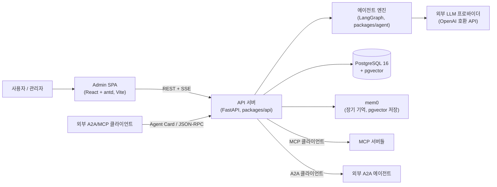
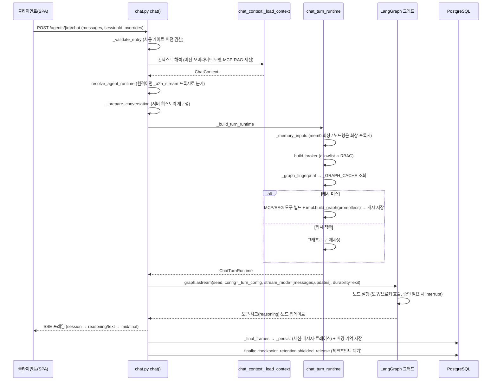
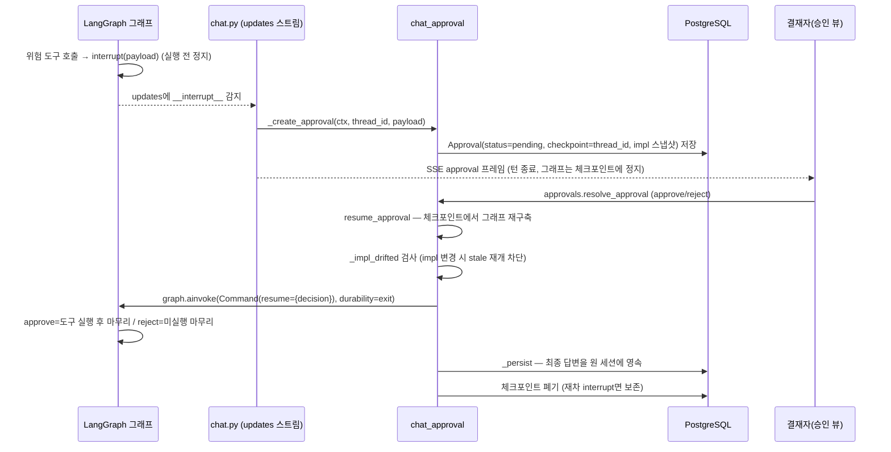
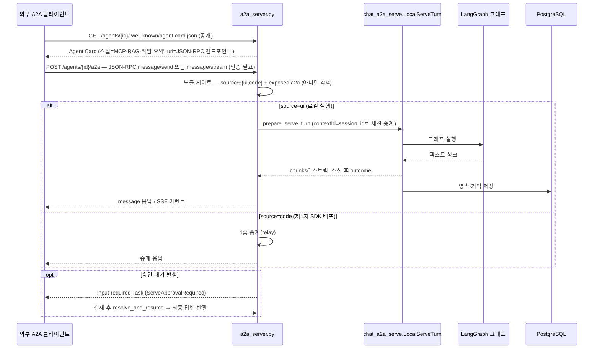

# 아키텍처 개요

> 초고(1차). 코드 실측 기준: `packages/api`, `packages/agent`, `admin`.
> 데이터 모델 상세는 [docs/db-model.md](./db-model.md)를 참조한다(이 문서는 중복 서술하지 않는다).

## 1. 개요

my-agents는 멀티 에이전트 플랫폼이다. 관리자 UI(React/antd SPA)에서 노코드로,
또는 SDK(`packages/agent`)로 코드로 에이전트를 만들고, 채팅/Playground로 실행하며,
A2A(Agent-to-Agent — 에이전트 간 표준 프로토콜)로 외부에 노출하거나 외부 에이전트를 등록해 쓴다.
백엔드는 FastAPI(`packages/api`)이고, 에이전트 실행 엔진은 LangGraph다.
에이전트에는 MCP(Model Context Protocol — 외부 도구 서버 표준) 도구,
RAG(Retrieval-Augmented Generation — 문서 검색으로 답변 근거를 보강) 컬렉션(pgvector),
mem0 장기 기억을 연결할 수 있다. 저장소는 PostgreSQL(alembic 마이그레이션),
인가는 casbin RBAC(역할 기반 접근 제어),
위험 도구 실행은 HIL(Human-in-the-Loop — 위험 작업 전 사람 승인) 게이트가 막는다.
모노레포는 uv workspace로 관리한다.

## 2. 시스템 컨텍스트

- Admin SPA는 REST로 관리하고, 채팅은 SSE(Server-Sent Events) 스트림으로 받는다.
- API는 우리 에이전트를 A2A 서버로도 노출하고(`a2a_server.py`), 커스텀 MCP를
  `/_served/mcp/{name}`으로도 서빙한다(`served_mcp`).
- mem0의 벡터 저장소도 같은 PostgreSQL(pgvector)을 쓴다.

## 3. 패키지 구조

uv workspace 모노레포이며, 멤버는 `packages/api`와 `packages/agent`, 프론트엔드는 `admin/`이다.

| 위치 | 책임 | 주요 의존 |
| --- | --- | --- |
| `packages/agent` | 에이전트 엔진. `CustomAgent` Protocol, 그래프 빌더(flows/examples), 신뢰 레지스트리 | langgraph, langchain, langchain-openai, mem0ai |
| `packages/api` | 플랫폼. REST/SSE, 인증·RBAC, 세션·영속, 브로커, MCP/RAG/메모리 런타임, A2A 서버/클라이언트, 배치·평가 | fastapi, sqlalchemy(asyncpg), alembic, casbin, fastapi-users, `agent` |
| `admin` | 관리자 SPA. 에이전트 저작, Playground, 승인, 관측 | react 18, antd 6, @ant-design/x, vite |

의존 방향은 단방향이다: **api가 agent를 의존하고, agent는 api를 모른다**
(`packages/agent/src/` 안에 `api` import가 없음을 확인. `packages/api/pyproject.toml`의
dependencies에 `agent`가 있고 그 역방향은 없다). agent 패키지는 플랫폼이 주입한
`AgentBuildContext`만 보고 그래프를 만들며 DB·정책을 직접 만지지 않는다.

API 내부는 파사드 + 형제 모듈 분할 패턴을 쓴다. 예: `chat.py`는 파사드(라우터 + `chat()`
오케스트레이터)이고, 실제 로직은 `chat_context*.py`(설정 해석), `chat_turn_runtime.py`(턴 재료),
`chat_graph_build.py`(그래프 지문·런타임 해석), `chat_approval.py`(승인·재개),
`chat_sse_frames.py`/`chat_final.py`(SSE 프레임·종결), `chat_persist.py`(영속)에 있다.

### 관리자 UI 메뉴 (`admin/src/admin/AdminShell.tsx`)

개요 · 에이전트 · 빌딩 블록 · 노드(노드 라이브러리) · RAG 컬렉션 · 세션 · 메모리 · 승인,
관리자 그룹(프로바이더·모델 / 유저 / 배치 / 허용 호스트 / 설정),
도구 그룹(Playground / 평가 / 가이드)으로 구성된다.

## 4. 에이전트 실행 모델

### 소스(source) 3분기

- `ui` — 관리자 UI에서 만든 로컬 에이전트. 우리 프로세스 안(LangGraph)에서 실행된다.
- `code` — SDK로 별도 배포된 제1자 에이전트. A2A로 호출한다.
- `external` — 제3자 A2A 에이전트(카드 등록). A2A로 호출하며 재공개는 차단된다.

판정 술어는 `agent.runtime`의 `is_remote_source`(code/external) ·
`is_first_party`(ui/code) 단일 출처다. 원격 소스는 `chat.py`에서 `_a2a_stream`
(`chat_a2a_proxy.py`)으로 프록시된다.

### impl(실행 방식)과 신뢰 레지스트리

로컬(ui) 에이전트는 `config["impl"]` 키로 실행 방식을 고른다. 키는
`agent/runtime.py`의 신뢰 레지스트리 `_REGISTRY`(코드 내 명시 dict)에서만 해석된다 —
`get_agent_impl`은 dict 조회와 `isinstance(inst, CustomAgent)` 검사만 하고,
문자열을 코드로 해석(eval/importlib)하는 경로가 없다. 등록은 `register_agent`로
모듈 로드 시 1회(`_bootstrap_builtins`).

| impl 키 | 클래스 | 성격 |
| --- | --- | --- |
| (미선언) | `DefaultUiAgent` | 직접 응답(기본) — ReAct(`create_agent`) 단일 그래프 |
| `route` | `flows/route.py: RouteAgent` | classify 후 조건 분기(answer_a/answer_b) |
| `plan_execute` | `examples/plan_execute.py: PlanExecuteAgent` | plan→execute 2노드, SDK 수기 레퍼런스 |
| `orchestrate` / `orchestrate_ranked` | `flows/orchestrate.py: FirstMatchOrchestrateAgent` / `RankedOrchestrateAgent` | 조율형 — 능력 브로커로 발견·위임·종합(공통 조상 `OrchestrationAgentBase`) |
| `pipeline` | `flows/pipeline.py: LinearPipelineAgent` | 노코드 노드형 — `config.nodes` 순서대로 일렬 실행 |
| `artifact_form` | `flows/artifact.py: ConfigDrivenArtifactAgent` | 산출물형 — produce→Artifact→sink, ask/form 멀티턴(interrupt) |

`CustomAgent` Protocol은 `describe() -> AgentManifest`와
`build_graph(ctx: AgentBuildContext) -> CompiledStateGraph` 두 메서드다.
`AgentManifest`는 `consumes`(실제로 읽는 설정 표면), `cacheable`(버전 그래프 캐시 적격),
`seed_prompt`(캐시 경로에서 시스템 프롬프트를 seed로 실을지)를 선언한다.
impl 선언이 미해결이면 `AgentConfigError`로 서빙을 거부한다(기본값으로 만회하지 않음 —
`resolve_agent_runtime`, `classify_runtime`의 3상태: conforming / non_conforming / config_error).

### 버전 — 활성화(오픈) 개념

에이전트 설정은 `AgentVersion` 행으로 버전화된다. **오픈(activate)** =
`POST /agents/{agent_id}/activate`(`agents/version_routes.py: activate_version`)가 라이브
포인터(`agent.active_version`)를 그 버전으로 옮기고 `ever_opened`를 영구 스탬프한다.
롤백은 예전 버전을 다시 오픈하는 같은 동사다. ui 에이전트의 첫 오픈에는 평가 게이트
(`_eval_gate_reason` — 성공 평가 런 수·평균 점수 임계)가 선다. 버전 지정 실행(미리보기)은
관리 권한이 필요하다(`chat.py: _validate_entry`). 프롬프트 등 블록은 pin(불변 payload)으로
버전에 고정된다(`block_versions.resolve_pinned`).

## 5. 요청 흐름

### 5.1 채팅 턴 — `POST /agents/{agent_id}/chat`

핵심 지점:
- 오버라이드(Playground)는 우회로가 아니라 지문에 흡수된다 — 모델·도구가 다르면 다른 캐시 엔트리.
- `thread_id`는 턴별 고유(`_resolve_graph_entry`)이며, 턴 종료 시 체크포인트를 폐기한다.
  interrupt로 멈춘 턴만 남긴다(`paused=bool(interrupts)`).
- 트레이스(`trace_capture.TraceCaptureHandler` + 노드 발화 실측)는 메시지와 함께 영속돼
  Playground 인스펙터가 소비한다.

### 5.2 HIL 승인 — interrupt → Approval → resolve → resume

- 승인 요구는 `runtime_mcp.resolve_tool_approval`이 해석한다: 도구 기본값(`tools_meta`의
  approval) > 레거시 `_APPROVAL_ACTIONS` 폴백 > 에이전트 `tool_policy` 오버라이드.
- 브로커 경유 능력도 같은 기계를 쓴다 — `PolicyScopedBroker._gate`가 부수효과 전송 이전에
  interrupt를 건다.
- 체크포인터는 `langgraph-checkpoint-postgres`(`AsyncPostgresSaver`, `checkpointer.py`)로
  Postgres에 공유돼 워커가 달라도 재개할 수 있다.

### 5.3 A2A 서빙 — 우리 에이전트를 외부에 노출

- 카드는 인증 없이 공개한다(등록 시 self-fetch 호환). JSON-RPC 호출만 `current_principal`
  인증을 건다. `A2A_SELF_BASE_URL`이 카드 url의 신뢰 경계다(Host 헤더 오염 방어).
- outcome은 `ServeCompleted | ServeApprovalRequired | ServeFailed` 3형이다.

## 6. 핵심 메커니즘

### 버전 그래프 캐시 (`_GRAPH_CACHE`)

컴파일된 그래프는 버전-고정 구조만 담을 때 캐시된다(`chat_turn_runtime._GRAPH_CACHE`,
최대 128개, 삽입순 축출). 적격 판정은 `chat_graph_build._cache_eligible` — impl이
`AgentManifest.cacheable=True`를 선언한 경우만(default/route/plan_execute/pipeline/orchestrate),
산출물형과 코드 노드 포함 파이프라인은 제외다. 지문(`_graph_fingerprint`)의 축은 impl 키 ·
모델 정체(base_url, api_key 지문, model_id, params, capabilities, temperature) · MCP 집합
(이름, 블록 버전, auth 지문) · 도구 필터 · 정책 · RAG · 체크포인터 유무 · 첨부 컨텍스트 ·
노드 해시 · 위임 가능 집합이다.

**이중 모드**: 캐시 경로는 그래프를 promptless(`prompt=""`)로 빌드하고 broker·회상 프록시·
히스토리 창을 전부 스트립한다. per-turn 재료는 매 호출 주입된다 — 시스템 프롬프트+회상은
seed 선두 `SystemMessage`로(`_seed_and_sent`, 노드는 `split_seed_prompt`로 수취),
broker·memory_recall·history_window·mcp_calls_sink는 `_turn_config`가 LangGraph
`configurable`로 싣는다. 캐시된 그래프가 유저/턴 상태를 물리적으로 담을 수 없어
턴 간 누출이 구조적으로 차단된다. 비적격 impl은 종전대로 매 턴 직접 빌드한다(무회귀).

### 능력 브로커 (`broker/core.py: PolicyScopedBroker`)

에이전트가 능력(capability — agent 위임·mcp 도구·rag 검색·memory 읽기/쓰기/수정)을
preload 대신 discovery로 쓴다: `discover(query)` → `describe(cap_id)` → `invoke(cap_id, args)`.
판정은 단일 헬퍼 `_permitted` = **에이전트 allowlist(config.capabilities) ∩ 유저 RBAC(casbin)**,
deny-by-default(allowlist가 비면 모집단 공집합, DB 미접촉)다. `invoke`는 discover 결과를
신뢰하지 않고 호출 경계에서 재검증한다(`_resolve` — TOCTOU 차단, 미허가·미존재를 동일하게
접어 존재를 노출하지 않음). 승인 요구 능력은 `_gate`가 전송 이전에 interrupt를 건다.
`build_broker`가 principal에서 RBAC 클로저를 만들고(superuser 우회, 머신 토큰은 deny),
provider 조립은 `composition.build_providers`(BrokerContext) 단일 출처다.

### 메모리 축 (mem0)

`api/memory/` 파사드가 백엔드(`MemoryBackend`, 기본 mem0, `MEMORY_BACKEND` env)로 위임한다.
스코프 축 3개: `user_id`(유저 사실 — 세션을 가로지름), `run_id`(세션 단기),
`agent_id`(에이전트 전용 지식). 회상(search)은 세 축을 따로 검색해 합집합으로 병합하고,
자동 저장(add)은 `user_id`+`run_id`만 쓴다 — `agent_id` 쓰기는 관리자 저작(agents CRUD)
전용이라 유저 사적 사실이 에이전트 축으로 새지 않는다(`chat_turn_runtime._memory_inputs`).
노드형은 선조회 대신 `_MemoryRecallProxy`(키워드 캐싱, 턴 수명)를 주입받아 노드가 각자
회상한다. 회상 실패는 대화를 막지 않는다(`memory.search`가 흡수해 빈 결과).

### RAG (pgvector)

컬렉션(collection) 단위로 문서를 인제스트(적재·색인 — 배경 작업, 재시작 시 좀비 정리)하고 청크를
pgvector에 저장한다. 검색 코어는 `rag_runtime.search_collections` 하나 — 질의를 **각
컬렉션이 인제스트에 쓴 임베딩 모델로** 임베딩해 cosine 유사도 상위 청크를 돌려주고,
인-챗 도구(`build_rag_tool`, 도구명 `search_documents`)와 시험 엔드포인트가 같은 코어를
쓴다. 노드형에는 컬렉션별 도구(`search_documents__<컬렉션>`)를 추가로 빌드해 노드가
컬렉션을 골라 참조한다. 재인덱싱은 새 벡터를 전량 계산한 뒤 한 트랜잭션으로 원자
스왑한다(검색 무중단). 최소 유사도 기준(`rag_min_scores`)은 에이전트 설정이다.

### MCP 도구

`runtime_mcp.build_mcp_tools`가 `langchain-mcp-adapters`(`MultiServerMCPClient`)로 서버에
연결해 도구를 LangChain 도구로 래핑한다. 도구 사양은 `_TOOL_SPEC_CACHE`에
**(서버명, 블록 버전, auth 토큰 지문)** 키로 캐시된다 — 버전 payload가 append-only 불변이라
TTL·무효화 로직이 필요 없다(새 버전=새 키). per-turn 래핑(calls_sink 기록·승인 게이트)은
캐시하지 않고 매 턴 수행해 동시 턴의 트레이스가 섞이지 않는다. 개발용 mock MCP는
`/_remote/mcp`에, 우리가 정의한 커스텀 MCP는 `/_served/mcp/{name}`에 실제 MCP
엔드포인트로 마운트된다(`main.py`).

### 관측

두 층이다. (1) 내부 트레이스 — `trace_capture.TraceCaptureHandler`와 노드 발화 실측을
메시지와 함께 영속해 Playground 인스펙터가 노드 타임라인·브로커 호출·회상·빌드 계측
(buildMs)을 보여준다. (2) 외부 OTEL(OpenTelemetry) — `observability.py`는
`OTEL_EXPORTER_OTLP_ENDPOINT` env가 있을 때만 OTLP span을 내보내고 없으면 무동작이다.
span에는 이름·모델·토큰 수·지연·에러 타입만 싣고 프롬프트·응답 본문은 싣지 않는다.

## 7. 기술 스택

| 레이어 | 기술 | 역할 |
| --- | --- | --- |
| 언어/런타임 | Python ≥3.12, TypeScript 5.6 | 백엔드 / 프론트엔드 |
| 웹 프레임워크 | FastAPI ≥0.115 + uvicorn | REST·SSE·A2A/MCP 서빙 |
| 에이전트 엔진 | LangGraph ≥1.2.5, LangChain ≥1.0, langchain-openai | 그래프 실행·ReAct·모델 호출 |
| 영속 | PostgreSQL 16(pgvector/pgvector:pg16), SQLAlchemy 2(asyncpg), alembic | 도메인 데이터·벡터·마이그레이션(부팅 시 `init_db`가 upgrade) |
| HIL 체크포인트 | langgraph-checkpoint-postgres(AsyncPostgresSaver) | interrupt 정지 상태의 워커 간 공유·재개 |
| 기억 | mem0ai ≥2.0.7 (pgvector 저장) | user/run/agent 축 장기 기억 |
| 도구 연동 | langchain-mcp-adapters, mcp(FastMCP) | MCP 클라이언트 / 자체 MCP 서빙 |
| 인증·인가 | fastapi-users, casbin(+async-sqlalchemy-adapter) | 세션 쿠키·머신 토큰 / RBAC |
| 배치 | apscheduler + advisory lock | 세션 정리·메모리 통합·체크포인트 스윕 |
| 관측 | opentelemetry-sdk + OTLP(http) exporter | 설정 시에만 span 방출 |
| 프론트엔드 | React 18, antd 6, @ant-design/x, Vite 6 | 관리자 SPA·채팅 UI |
| 빌드/워크스페이스 | uv workspace, hatchling | 모노레포 의존 관리 |

## 8. 배포 토폴로지

**개발(기본)**: `docker-compose`로 PostgreSQL(pgvector) 하나, `api.main:run`이 단일
uvicorn(reload — `packages/api`·`packages/agent` 소스 둘 다 watch)을 띄우고, admin은
`vite` dev 서버로 돈다. 부팅 lifespan이 alembic upgrade·authz 초기화·admin 시드·
체크포인터·배치 스케줄러·좀비 정리를 수행한다.

**다중 워커 주의점**: 그래프 캐시(`_GRAPH_CACHE`), MCP 도구 사양 캐시(`_TOOL_SPEC_CACHE`),
산출물 대기 포인터(`_PENDING_ARTIFACT`)는 **프로세스 로컬**이다 — 워커마다 따로 데워지고,
워커 수만큼 메모리를 쓴다. 반면 HIL 체크포인트는 Postgres 공유라 승인 재개는 어느 워커에서든
동작하고, 배치 스케줄러는 advisory lock으로 리더 하나만 발화한다(`batch_service.start_inproc`).
산출물형 ask/form 대기는 프로세스 재시작 시 소실되며 다음 입력이 새 실행으로 폴백한다
(코드에 명시된 P1 경계). 프로덕션 실행은 reload 없이 uvicorn을 직접 띄운다.
