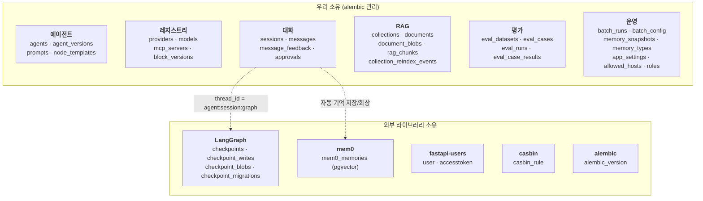
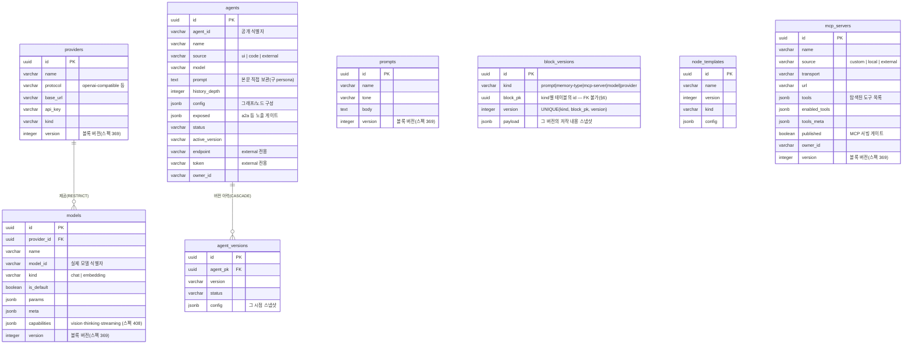
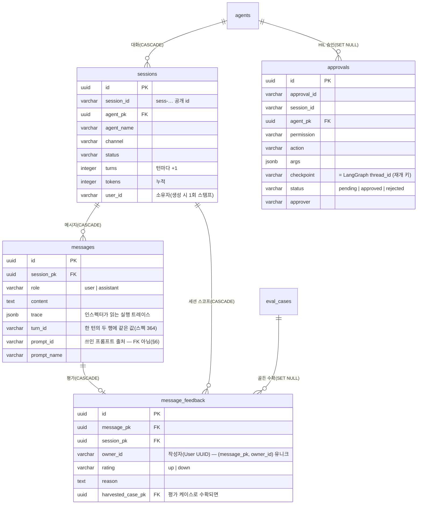
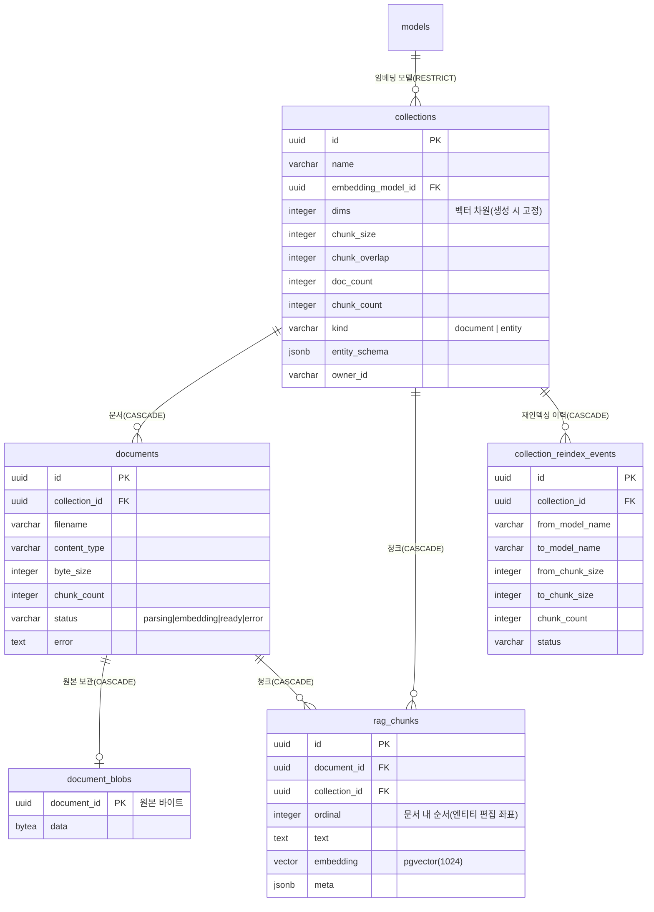
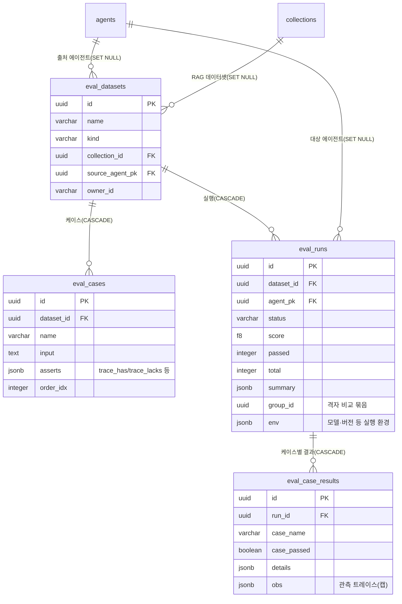
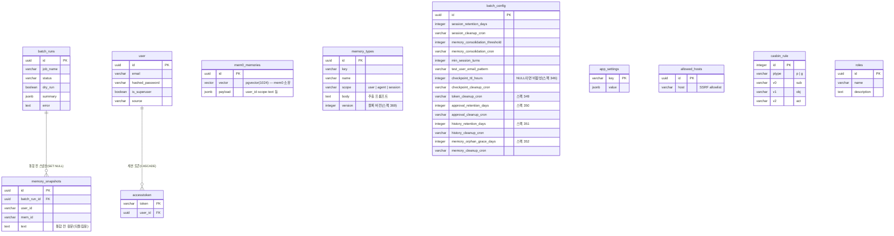

# 데이터베이스 모델 (PostgreSQL + pgvector)

> 이 문서는 **살아 있는 DB에서 덤프한 실제 스키마**를 근거로 작성했다(모델 파일이 아니라 실물 —
> 어긋나면 실물이 이긴다). 2026-07-21 재검증 기준, 37개 테이블. alembic head `9c13f807b6c2`(스펙 408).
> 감사 컬럼(스펙 343) 반영. 2026-07-14판 이후 드리프트: `personas`→`prompts` 개명(스펙 365) ·
> `block_versions` 신설(스펙 369) · `messages` 턴/프롬프트 출처 컬럼(스펙 364) · `models.capabilities`
> (스펙 408) · `batch_config` 보존 잡 노브 확장 — 아래 본문에 반영했다.
> 스키마의 단일 진실은 **alembic**이다(스펙 330 — `init_db`의 create_all 폴백은 제거됐다).

## 감사 컬럼 (스펙 343) — 아래 모든 다이어그램에 공통

**우리 소유 28테이블 전부**가 아래 4컬럼을 갖는다(실측: 28/28, 2026-07-21). 다이어그램마다 반복하면 읽기만
나빠지므로 여기 한 번만 적는다 — 각 ERD의 엔티티에는 **표시하지 않았지만 전부 붙어 있다**.

| 컬럼 | 값 | 규칙 |
|---|---|---|
| `created_at` / `updated_at` | timestamptz, NOT NULL | 최초 삽입 시 둘 다 채워짐(created == updated) |
| `created_by` / `updated_by` | varchar(80), NOT NULL | **이메일의 `@` 앞**(`admin@example.com` → `admin`) |

- 사람이 아닌 주체(시드·마이그레이션·배치·**모든 배경 잡**)는 **`system`**. 스펙 343 이전 행은 `unknown`.
- `created_*`는 **불변**(수정 시 옛 값으로 되돌림). "누가 만들었나"와 "누가 마지막에 만졌나"가 갈린다.
- 값을 채우는 곳은 **앱 계층**(`api/audit.py`의 `AuditMixin` — 컬럼 default/onupdate). **DB 트리거는 없다**
  (사용자 결정: 로직이 DB에 숨는 방식 금지). 배경 잡의 actor는 `background.spawn()` 한 관문에서 `system`.
- **제외 9개**(외부 라이브러리 소유): checkpoint 4종 · mem0_memories · user · accesstoken · casbin_rule ·
  alembic_version. `user`·`accesstoken`은 원래 있던 `created_at`만 갖는다.
- ⚠️ `owner_id`(현재 소유자, 인가 판정용)와 `created_by`(최초 생성자, 감사용)는 **다른 개념**이다 — §6 참고.

## 0. 한 장 지도 — 누가 무엇을 소유하나

테이블은 **우리가 소유하는 것**과 **외부 라이브러리가 소유하는 것**으로 갈린다. 후자는 alembic이
건드리지 않는다(라이브러리가 스스로 만들고 마이그레이션한다).

## 1. 에이전트 · 레지스트리

에이전트는 `source`로 3분기한다: `ui`(관리자가 만든 것) · `code`(코드로 정의) · `external`(A2A 원격).
`agents.prompt`는 **텍스트 컬럼**이고 `prompts` 테이블과 FK로 묶여 있지 않다(§6 참고 — 구 `persona`/
`personas`를 스펙 365에서 개명). 레지스트리 블록 5종(prompt · memory-type · mcp-server · model ·
provider)은 각자 `version` 정수를 갖고, 편집 이력은 공유 테이블 `block_versions`에 쌓인다(스펙 369).

## 2. 대화 (채팅 한 턴이 쓰는 곳)

`messages.trace`가 **플레이그라운드 인스펙터의 유일한 저장소**다 — 인스펙터 전용 테이블은 없다.

**한 턴의 쓰기(실측, 2026-07-14)** — 평범한 채팅 1회 기준:

| 테이블 | 델타 | 비고 |
|---|---|---|
| `sessions` | +1(신규) 또는 행 갱신 | `turns`·`tokens` 누적 |
| `messages` | +2 | user + assistant(trace 동봉) |
| `checkpoints`/`_writes`/`_blobs` | 각 **+3 ~ +7** | 1 + 슈퍼스텝 수 + 1 (그래프 모양에 비례) |
| `mem0_memories` | +0~N | 기억할 내용이 있을 때만 |
| `approvals` | HIL 인터럽트 시에만 +1 | |
| `message_feedback` | 사용자가 평가할 때만 +1 | |

끄기 스위치: `persistHistory=false` → `messages`만 스킵 · `ephemeral=true`(스펙 235) → 세션·메시지·커밋 전부 스킵(DB 무접촉).

## 3. RAG

원본은 `document_blobs`에 통째로 보관한다 — 재인덱싱·문서 수정(전체 교체 후 재임베딩)의 근거가 된다.
`collections.kind`가 `document`(일반 문서)와 `entity`(JSONL 엔티티)를 가른다.

`documents.status`는 배경 인제스트(스펙 334)의 **상태머신**이다: `parsing → embedding → ready`,
실패 시 `error`. 부팅 시 좀비(재시작을 못 넘긴 `parsing`/`embedding`)는 `error`로 박제된다.

## 4. 평가

## 5. 메모리 · 운영 · 인증

## 6. FK가 **없는** 논리적 관계 (알고 있어야 할 것)

ERD에 선이 없다고 관계가 없는 게 아니다. 아래는 코드가 문자열로 잇는 관계다 — DB가 무결성을
지켜주지 않으므로 삭제·개명 시 조용히 끊긴다.

| 참조 | 대상 | 왜 FK가 아닌가 |
|---|---|---|
| `agents.prompt` (text) | `prompts.body` | 에이전트가 프롬프트 본문을 **복사해 보관**한다(프롬프트 수정이 기존 에이전트를 바꾸지 않도록 — 스펙 365 개명 전 `persona`/`personas`) |
| `block_versions.block_pk` (uuid) | 5종 블록 테이블의 `id` | **kind별로 대상 테이블이 달라 FK 불가**(폴리모픽) — 블록 삭제 시 이력은 앱 레벨 같은 트랜잭션에서 삭제(스펙 369) |
| `messages.prompt_id`/`prompt_name` | `prompts` | **출처 기록(provenance)** — 프롬프트가 삭제돼도 역사 기록은 살아남아야 하므로 FK를 걸지 않는다(스펙 364) |
| `sessions.user_id`, `*.owner_id` (varchar) | `user.id` | 소유자를 문자열로 스탬프(외부 주체·머신 토큰도 담기 위해) |
| `*.created_by` / `*.updated_by` (varchar) | (어떤 테이블도 아님) | **의도적으로 FK가 아니다**(스펙 343) — `user`에 등록된 사람은 **관리자(부분집합)**뿐이고, 추후 **채팅으로 미등록 최종 사용자 ID가 이 컬럼에 들어온다**. FK로 묶으면 그때 못 담는다. 값 공간 = 관리자 로컬파트 ∪ `system`·`unknown` ∪ 최종 사용자 ID(추후) |
| `approvals.session_id` (varchar) | `sessions.session_id` | 공개 id 문자열로 참조 |
| `approvals.checkpoint` (varchar) | `checkpoints.thread_id` | **테이블 주인이 LangGraph**라 FK를 걸 수 없다 |
| `agents.model`, `eval_runs.model_name` | `models.name` | 이름 문자열 참조 |
| `mem0_memories.payload.user_id` | `user.id` | mem0가 payload JSONB에 담는다(스키마 주인이 mem0) |

### owner_id와 created_by는 다르다 (자주 헷갈리는 지점)

| | `owner_id` (7테이블 + `sessions.user_id`) | `created_by` (28테이블 전부) |
|---|---|---|
| 뜻 | **현재 소유자** — 이전될 수 있다 | **최초 생성자** — 불변 |
| 값 | auth User **UUID** 문자열 | 이메일 **로컬파트**(또는 `system`/`unknown`) |
| 쓰임 | **인가 판정**(볼 수 있나·고칠 수 있나) | **감사**(누가 만들었나) |

`message_feedback`은 원래 작성자 컬럼을 `created_by`라 불렀는데, 343의 감사 컬럼과 **이름만 같고
개념이 달라** `owner_id`로 개명했다(다른 테이블과 같은 이름·같은 값 형식). 인가에 `created_by`를
쓰면 안 된다 — 소유권이 이전되면 거짓말이 된다.

## 7. 라이프사이클 주의점

- **체크포인트 정리 경로가 생겼다(스펙 346 — 2026-07-14판의 "삭제 경로 없음"은 해소).** 턴당
  `1 + 슈퍼스텝 수 + 1`행이 `checkpoints`·`checkpoint_writes`·`checkpoint_blobs`에 각각 쌓이는 것은
  그대로이나, 정상 경로는 **턴 종료 관문**(`checkpoint_retention.release_thread`)이 지우고, 관문을
  못 넘긴 잔여(프로세스 사망 등)는 **TTL 배치**(`cleanup_checkpoints`, `batch_config.checkpoint_ttl_hours`
  — NULL/1 미만이면 비활성)가 회수한다. HIL 재개(`approvals.checkpoint`)의 근거라 턴 중엔 필수.
- **대화 이력은 두 곳에 중복 보관**된다: `messages`(우리) + `checkpoints`(LangGraph 채널 상태).
- **벡터 차원은 생성 시 고정**된다(`collections.dims`, `mem0_memories.vector`, `rag_chunks.embedding`
  모두 1024). 차원이 다른 임베딩 모델로 바꾸려면 재인덱싱이 아니라 저장 구조 재설계가 필요하다.
- **RAG 수정은 전체 교체 → 재인덱싱**이다(부분 행 편집 없음 — 원본 `document_blobs`와의 동기화 때문).
- **감사 컬럼은 DB가 강제하지 않는다**(트리거 없음 — 스펙 343). 앱을 거치는 모든 경로(ORM·Core
  `insert()`/`update()`)는 자동으로 채워지지만, **raw `text()` SQL이나 `.values(created_by=…)`로
  대놓고 덮어쓰면 DB가 막지 못한다**. 그 우회가 코드에 없다는 것은 상주 스캔 테스트(verify_343
  V9·V10·V11)가 지킨다 — 새 코드가 우회를 들이면 그 테스트가 실패한다.
- **백필은 27테이블 full-table UPDATE**였다(마이그레이션 `a7f3c9e21b4d`). 현 규모(수천 행)에선
  무해하나 **운영 규모에선 배치 백필·`lock_timeout`이 필요**하다.
