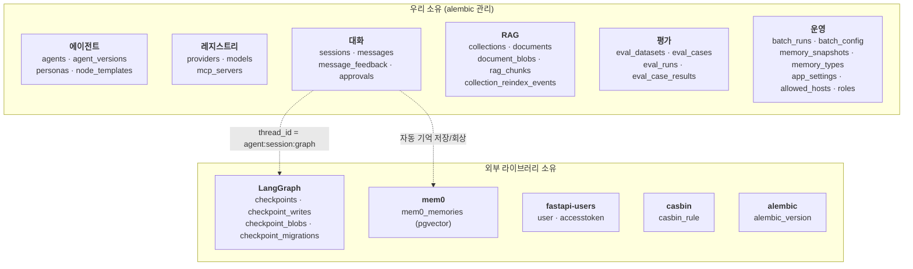
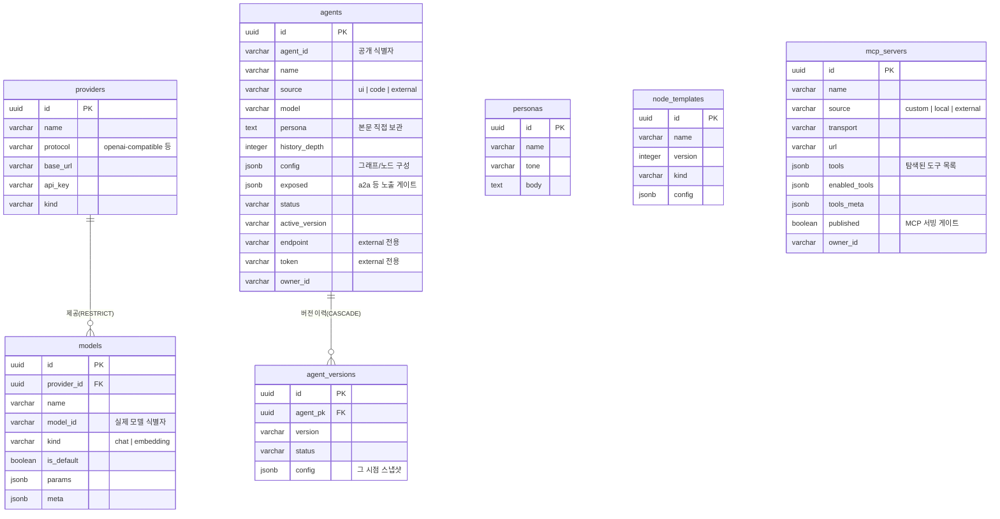
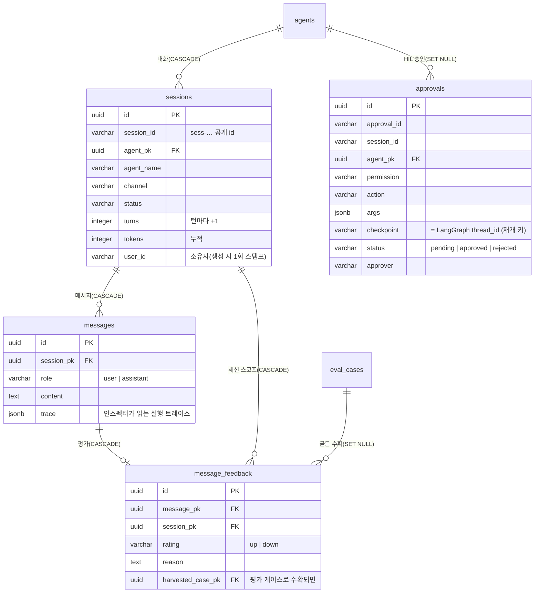
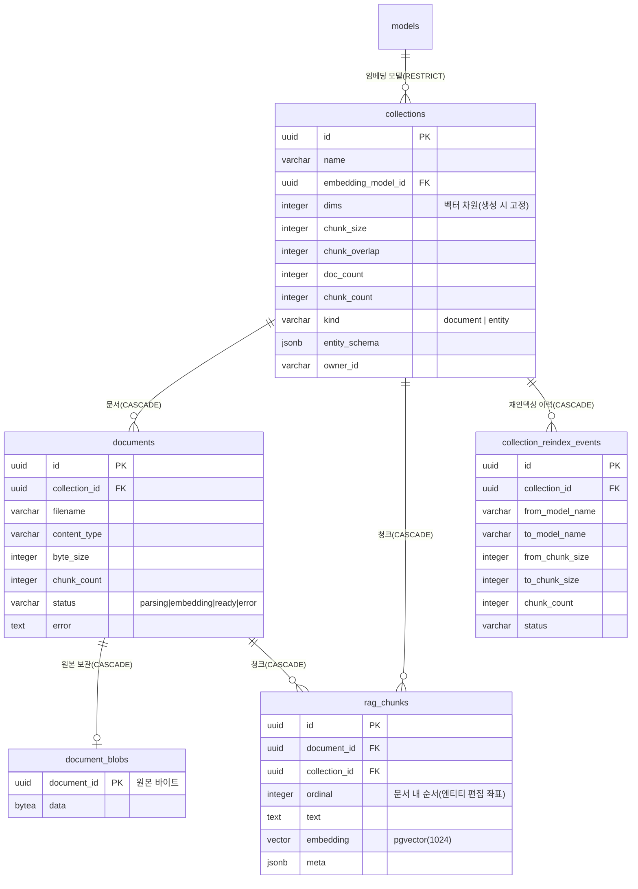
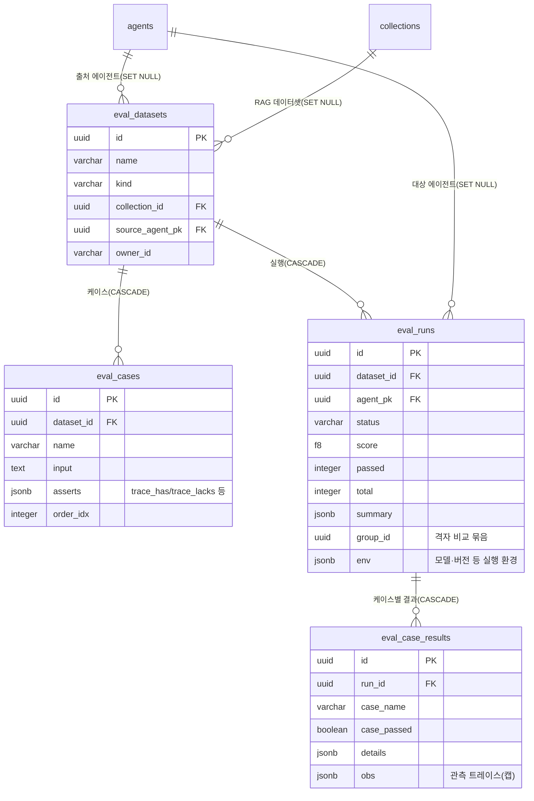
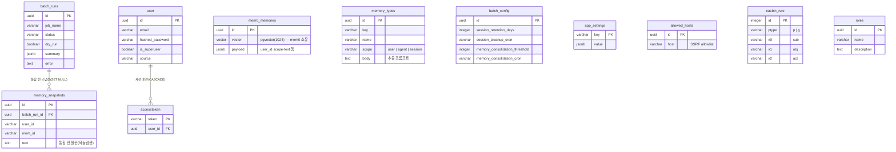

# 데이터베이스 모델 (PostgreSQL + pgvector)

> 이 문서는 **살아 있는 DB에서 덤프한 실제 스키마**를 근거로 작성했다(모델 파일이 아니라 실물 —
> 어긋나면 실물이 이긴다). 2026-07-14 기준, 36개 테이블.
> 스키마의 단일 진실은 **alembic**이다(스펙 330 — `init_db`의 create_all 폴백은 제거됐다).

## 0. 한 장 지도 — 누가 무엇을 소유하나

테이블은 **우리가 소유하는 것**과 **외부 라이브러리가 소유하는 것**으로 갈린다. 후자는 alembic이
건드리지 않는다(라이브러리가 스스로 만들고 마이그레이션한다).

## 1. 에이전트 · 레지스트리

에이전트는 `source`로 3분기한다: `ui`(관리자가 만든 것) · `code`(코드로 정의) · `external`(A2A 원격).
`agents.persona`는 **텍스트 컬럼**이고 `personas` 테이블과 FK로 묶여 있지 않다(§6 참고).

## 2. 대화 (채팅 한 턴이 쓰는 곳)

`messages.trace`가 **플레이그라운드 인스펙터의 유일한 저장소**다 — 인스펙터 전용 테이블은 없다.

**한 턴의 쓰기(실측, 2026-07-14)** — 평범한 채팅 1회 기준:

| 테이블 | 델타 | 비고 |
|---|---|---|
| `sessions` | +1(신규) 또는 행 갱신 | `turns`·`tokens` 누적 |
| `messages` | +2 | user + assistant(trace 동봉) |
| `checkpoints`/`_writes`/`_blobs` | 각 **+3 ~ +7** | 1 + 슈퍼스텝 수 + 1 (그래프 모양에 비례) |
| `mem0_memories` | +0~N | 기억할 내용이 있을 때만 |
| `approvals` | HIL 인터럽트 시에만 +1 | |
| `message_feedback` | 사용자가 평가할 때만 +1 | |

끄기 스위치: `persistHistory=false` → `messages`만 스킵 · `ephemeral=true`(스펙 235) → 세션·메시지·커밋 전부 스킵(DB 무접촉).

## 3. RAG

원본은 `document_blobs`에 통째로 보관한다 — 재인덱싱·문서 수정(전체 교체 후 재임베딩)의 근거가 된다.
`collections.kind`가 `document`(일반 문서)와 `entity`(JSONL 엔티티)를 가른다.

`documents.status`는 배경 인제스트(스펙 334)의 **상태머신**이다: `parsing → embedding → ready`,
실패 시 `error`. 부팅 시 좀비(재시작을 못 넘긴 `parsing`/`embedding`)는 `error`로 박제된다.

## 4. 평가

## 5. 메모리 · 운영 · 인증

## 6. FK가 **없는** 논리적 관계 (알고 있어야 할 것)

ERD에 선이 없다고 관계가 없는 게 아니다. 아래는 코드가 문자열로 잇는 관계다 — DB가 무결성을
지켜주지 않으므로 삭제·개명 시 조용히 끊긴다.

| 참조 | 대상 | 왜 FK가 아닌가 |
|---|---|---|
| `agents.persona` (text) | `personas.body` | 에이전트가 페르소나 본문을 **복사해 보관**한다(페르소나 수정이 기존 에이전트를 바꾸지 않도록) |
| `sessions.user_id`, `*.owner_id` (varchar) | `user.id` | 소유자를 문자열로 스탬프(외부 주체·머신 토큰도 담기 위해) |
| `approvals.session_id` (varchar) | `sessions.session_id` | 공개 id 문자열로 참조 |
| `approvals.checkpoint` (varchar) | `checkpoints.thread_id` | **테이블 주인이 LangGraph**라 FK를 걸 수 없다 |
| `agents.model`, `eval_runs.model_name` | `models.name` | 이름 문자열 참조 |
| `mem0_memories.payload.user_id` | `user.id` | mem0가 payload JSONB에 담는다(스키마 주인이 mem0) |

## 7. 라이프사이클 주의점

- **체크포인트는 지워지지 않는다.** 턴당 `1 + 슈퍼스텝 수 + 1`행이 `checkpoints`·`checkpoint_writes`·
  `checkpoint_blobs`에 각각 쌓이고(단일 노드 3, 멀티 노드 7 실측), **삭제 경로가 코드에 없다**.
  HIL 재개(`approvals.checkpoint`)의 근거라 턴 중엔 필수지만, 끝난 뒤 정리가 없다. 운영 시 과제
  (백로그 등재 — 세션 종료 시 `adelete_thread` / TTL 배치 / HIL 미사용 에이전트 미부착).
- **대화 이력은 두 곳에 중복 보관**된다: `messages`(우리) + `checkpoints`(LangGraph 채널 상태).
- **벡터 차원은 생성 시 고정**된다(`collections.dims`, `mem0_memories.vector`, `rag_chunks.embedding`
  모두 1024). 차원이 다른 임베딩 모델로 바꾸려면 재인덱싱이 아니라 저장 구조 재설계가 필요하다.
- **RAG 수정은 전체 교체 → 재인덱싱**이다(부분 행 편집 없음 — 원본 `document_blobs`와의 동기화 때문).
