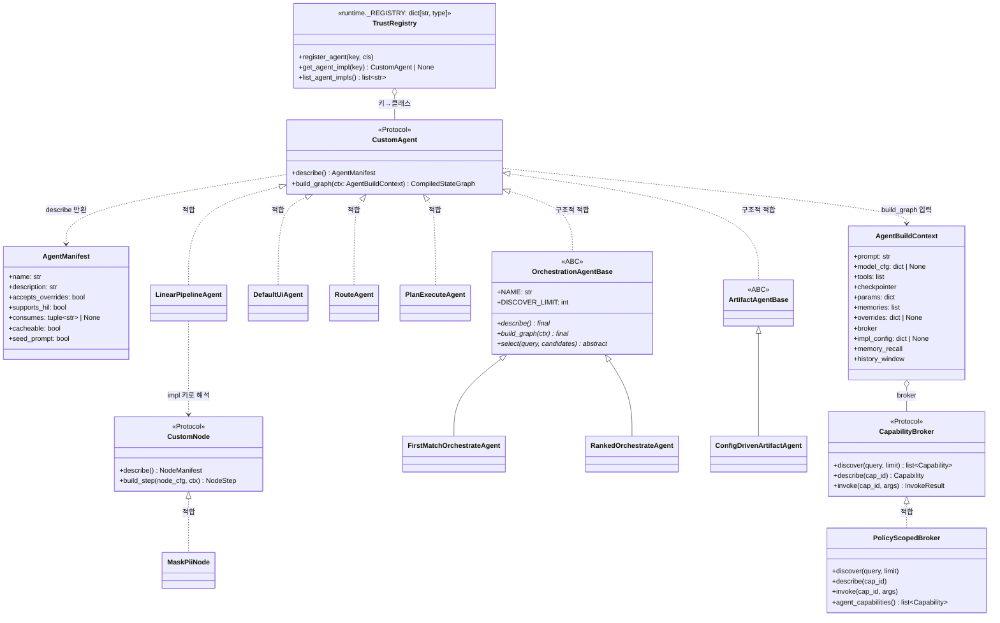

# 개발자 가이드 — 코드 기반(SDK) 에이전트 만들기

## 1. 개요

이 가이드는 my-agents 플랫폼 위에서 **코드로 에이전트를 만들어 등록·실행**하는 방법을 다룬다.
읽고 나면 다음을 혼자서 할 수 있다.

- **SDK 에이전트(in-process 커스텀 구현)** — LangGraph `StateGraph`를 직접 조립하는 에이전트를
  작성하고, 신뢰 레지스트리에 등록하고, REST API로 `config.impl`을 지정해 Playground에서 실행.
- **코드 노드** — 노드형(파이프라인) 에이전트의 한 스텝을 코드로 구현해 등록.

전제 독자: 3년차 개발자, LangGraph 기초(StateGraph·노드·엣지 개념) 보유. LangGraph 자체 문법은
필요한 만큼만 등장하며, 이 문서의 초점은 **플랫폼과의 계약**(무엇을 주입받고, 무엇을 지켜야 하나)이다.

핵심 설계 한 줄: **주입·추적은 그래프가 아니라 그것을 돌리는 루프의 속성이다.** 커스텀 에이전트는
`build_graph(ctx)`로 "그래프를 어떻게 만들지"만 책임지고, 설정 주입·호출 추적·토큰 스트림은
플랫폼이 책임진다(`packages/agent/src/agent/runtime.py` 모듈 docstring).

## 2. 기본 정보

### 아키텍처

플랫폼은 두 파이썬 패키지와 하나의 SPA로 구성된다. `packages/api`(FastAPI)가
에이전트/모델/MCP(Model Context Protocol — 외부 도구 서버 표준) 레지스트리와 채팅 런타임을
소유하고, `packages/agent`가 그래프 조립 SDK(이 가이드의 대상)를 소유한다.
채팅 한 턴의 흐름: API가 에이전트 설정을 읽어 `ChatContext`를 만들고 →
`resolve_agent_runtime`이 `config.impl` 키로 in-process 구현을 해석하고 → 그 구현의
`build_graph(ctx)`가 돌려준 LangGraph 그래프를 플랫폼 루프가 `astream`으로 돌리며 토큰·노드
업데이트를 SSE(Server-Sent Events)로 흘린다. 에이전트 소스는 3분기다: `ui`(관리자가 빌더로 작성) ·
`code`(코드 정의, A2A(Agent-to-Agent — 에이전트 간 표준 프로토콜)로 원격 실행) ·
`external`(제3자 A2A). in-process 인터페이스의 대상은
로컬(`ui`) 에이전트다 — `code`/`external`은 A2A 프록시 경로로 처리된다
(`packages/agent/src/agent/runtime.py`의 `is_remote_source`). 아키텍처 전체 개요는
[architecture.md](./architecture.md), 데이터 모델은 [db-model.md](./db-model.md),
실행·초기 구동 절차는 [README.md](../README.md) 참고.

### 기술 스택

| 층 | 기술 | 근거 파일 |
|---|---|---|
| 언어·패키징 | Python 3.12, uv 워크스페이스(hatchling 빌드) | `pyproject.toml`, `packages/*/pyproject.toml` |
| 그래프 런타임 | LangGraph ≥ 1.2.5, langchain ≥ 1.0, langchain-openai ≥ 1.3.2 | `packages/agent/pyproject.toml` |
| API 서버 | FastAPI, uvicorn, SQLAlchemy(asyncio) + asyncpg, alembic | `packages/api/pyproject.toml` |
| DB | PostgreSQL + pgvector | `docker-compose`(README), `docs/db-model.md` |
| 장기 기억 | mem0ai ≥ 2.0.7 (pgvector 벡터 스토어) | `packages/agent/pyproject.toml` |
| HIL(Human-in-the-Loop — 사람 승인) 체크포인트 | langgraph-checkpoint-postgres(AsyncPostgresSaver) | `packages/api/pyproject.toml` |
| 인증·인가 | fastapi-users, casbin(RBAC) | `packages/api/pyproject.toml` |
| MCP | langchain-mcp-adapters, mcp SDK(FastMCP) | `packages/api/pyproject.toml` |
| 관측 | opentelemetry-sdk + OTLP exporter | `packages/api/pyproject.toml` |
| Admin SPA | React + TypeScript + Ant Design(vite) | `README.md` |

### 테이블 모델링 핵심

전체 ER 다이어그램·라이프사이클은 [db-model.md](./db-model.md)가 정본이다. 에이전트 개발자가
최소한 알아야 할 테이블만 추린다.

| 테이블 | 역할 | 개발자 관점 포인트 |
|---|---|---|
| `agents` | 에이전트 정의 | `source`(ui/code/external), `config`(JSONB — **여기의 `impl` 키**가 SDK 구현 선택), `persona`(프롬프트 본문) |
| `agent_versions` | 버전별 config 스냅샷 | 그래프 캐시 지문의 재료 |
| `providers` / `models` | 모델 레지스트리 | `ctx.model_cfg`의 출처(base_url·model_id·params·capabilities) |
| `sessions` / `messages` | 대화·트레이스 | `messages.trace`가 Playground 인스펙터의 유일한 저장소 |
| `approvals` | HIL 승인 | `checkpoint` = LangGraph thread_id(재개 키) |
| `mcp_servers` | MCP 블록 | `published` 게이트, 도구 목록(`tools`) — `ctx.tools`의 출처 |
| `collections` / `rag_chunks` | RAG(문서 검색으로 답변 근거 보강) 컬렉션 | 컬렉션 검색이 `search_documents` 도구로 주입됨 |
| `user` / `casbin_rule` | 인증·RBAC | 브로커·도구 스코프의 근거 |

### 저장소 구조

uv 워크스페이스(`pyproject.toml`의 `[tool.uv.workspace] members = ["packages/*"]`)이며 패키지
의존 방향은 **단방향**이다: `api` → `agent` (`packages/api/pyproject.toml` dependencies에
`agent`). 역방향 import는 없다 — agent 패키지는 DB·정책을 모르고, 플랫폼(api)이 해석한 값을
주입받는다.

```
packages/
  agent/src/agent/         # SDK — 그래프 조립(이 가이드의 주 무대)
    runtime.py             #   CustomAgent Protocol · AgentBuildContext · 신뢰 레지스트리
    nodes.py               #   코드 노드(CustomNode) 레지스트리
    flows/                 #   route · pipeline · orchestrate · artifact 구현
    examples/plan_execute.py
    toolbox.py             #   도구 하이브리드(effective_tools) · last_user_text
    model.py               #   build_chat_openai(모델 구성 정본)
  api/src/api/             # 플랫폼 — FastAPI, 채팅 런타임, 브로커, RBAC
admin/                     # 관리 SPA(React)
tests/                     # 검증 자산(run_suite, e2e)
docs/                      # 인간 영역 문서(spec/adr/db-model)
```

### 로컬 실행·테스트

README의 first run 절차 요약(정본: [README.md](../README.md)):

```bash
docker compose up -d postgres   # pgvector 번들 PostgreSQL
uv sync
uv run api                      # FastAPI, 127.0.0.1:8000 (부팅 시 alembic upgrade + 시드 자동)
cd admin && npm install && npm run dev   # admin SPA, 5173
```

기본 모델은 Mock LLM(외부 서버 없이 동작)이고, 실모델은 admin의 프로바이더·모델 화면에서 추가한다.

테스트·품질 게이트(`Makefile` 실측):

| 명령 | 내용 |
|---|---|
| `make test` | 회귀망 씨앗 그물(unit + db 층, `tests/run_suite.py`) |
| `make test-unit` | 순수층만(무의존·최속) |
| `make test-all` | 전층(http 포함 — dev 서버 8000 전제) |
| `make suite` | 실모델 조합 스위트(동작 불변 최종 게이트) |
| `make metrics-fast` | lint + format-check + 복잡도 + MI + 네이밍 + mypy |
| `make metrics` | metrics-fast + suite (완료 판정자) |
| `make e2e` | Playwright(API 8000 + Postgres 전제) |

## 3. SDK 에이전트 핵심 계약

정본 파일: `packages/agent/src/agent/runtime.py`.

### CustomAgent Protocol

커스텀 에이전트는 클래스 상속 없이 **구조적 적합**(Python `Protocol`)으로 판정된다. 메서드 두 개만
있으면 된다.

```python
# packages/agent/src/agent/runtime.py
@runtime_checkable
class CustomAgent(Protocol):
    def describe(self) -> AgentManifest: ...

    def build_graph(self, ctx: AgentBuildContext) -> CompiledStateGraph: ...
```

`build_graph`가 돌려준 그래프는 플랫폼의 기존 호출 계약을 만족해야 한다(같은 파일 docstring):
`astream({"messages": ...}, stream_mode=["messages", "updates"])`로 토큰·노드 업데이트를 내고,
위험 도구가 있으면 `__interrupt__` / `ainvoke(Command(resume=...))`로 멈추고 재개한다. 플랫폼은
그래프 내부를 모른 채 루프만 돌린다.

### AgentBuildContext — 플랫폼이 주입하는 모든 것

에이전트는 이 ctx만 보고 그래프를 만든다 — 자기 설정을 DB에서 직접 읽지 않는다(주입 단일 출처).
오버라이드는 이미 병합된 상태로 도착한다.

| 필드 | 타입 | 언제·무엇이 채우나 | per-turn / 버전-고정 |
|---|---|---|---|
| `prompt` | `str` | 오버라이드 병합 후 시스템 프롬프트. **캐시 경로에서는 `""`(promptless 빌드)** — 4장의 이중 모드 참조 | per-turn(직접 빌드) / 캐시 경로엔 빈 값 |
| `model_cfg` | `dict \| None` | 모델 레지스트리 해석본(base_url·model_id·api_key·params·capabilities). `build_chat_openai`에 그대로 전달 | 버전-고정에 준함(변경은 캐시 지문 축으로 분리) |
| `tools` | `list` | 에이전트 config(mcps·vectorTables)에서 조립된 LangChain 도구. **이미 RBAC 스코프·HIL 래핑·트레이스 래핑 완료** | 빌드 시 주입(변경은 지문 축이 분리) |
| `checkpointer` | `Any` | HIL durable 체크포인터(스펙 041). `None`이면 무상태 | 빌드 시 주입 |
| `params` | `dict` | temperature 등 런타임 파라미터(세션 레이어) | per-turn |
| `memories` | `list` | 회상된 기억. 플랫폼이 이미 prompt에 접어 넣을 수 있음 | per-turn |
| `overrides` | `dict \| None` | 원본 오버라이드(추가 키를 직접 읽고 싶을 때) | per-turn |
| `broker` | `Any` | 능력 브로커(스펙 100). **플랫폼이 정책으로 미리 스코프**해 주입. `None`이면 발견 공집합(deny-by-default) | per-turn — 캐시 그래프에서는 `RunnableConfig`로 매 호출 주입 |
| `impl_config` | `dict \| None` | 에이전트별 impl 설정(예: `config.nodes`, `config.artifactSpec`). 코드 저작 에이전트는 대개 안 본다 | 버전-고정(캐시 지문 축) |
| `memory_recall` | `Any` | 회상 프록시 — `async callable(query \| None, node) → 포맷 텍스트`. `None`=회상 없음 | per-turn 프록시(config-우선 주입) |
| `history_window` | `Any` | 단기 기억 창 프록시 — `async callable(depth \| None, node) → 이전 대화 메시지 리스트`. 노드형만 주입 | per-turn 프록시(config-우선 주입) |

### AgentManifest — 자기소개 선언

`describe()`가 반환한다. 선언은 장식이 아니라 **플랫폼 게이트가 실제로 읽는 계약**이다.

| 필드 | 타입·기본값 | 의미와 선언 기준 |
|---|---|---|
| `name` | `str` | 표시 이름 |
| `description` | `str = ""` | 한 줄 설명 |
| `accepts_overrides` | `bool = True` | Playground 설정 주입(오버라이드) 수용 여부 |
| `supports_hil` | `bool = True` | HIL interrupt/`Command(resume)` 계약 지원 여부. interrupt를 낼 수 없는 그래프면 **False로 정직하게 표기**(route·plan_execute가 선례). 재개 경로의 드리프트 가드가 이 값을 검사한다 |
| `consumes` | `tuple[str, ...] \| None = None` | 이 impl이 실제로 읽는 설정 표면 — `"mcps" \| "vectorTables" \| "memories" \| "capabilities" \| "artifactSpec"`(+노드형 `"nodes"`). `None`=미선언(편집 폼 전부 노출). 선언하면 admin 폼이 안 읽는 표면을 숨기고, 저장된 연결이 있으면 "무시됩니다" 경고 |
| `cacheable` | `bool = False` | **버전 캐시 적격 선언(스펙 421).** True로 선언해도 되는 조건: 그래프에 per-turn 재료(회상기억·broker·프록시·이번 턴의 프롬프트)를 **굽지 않을 것**. True면 플랫폼이 그래프를 promptless(`prompt=""`)로 빌드해 버전 지문으로 캐시하고, 시스템 프롬프트+회상은 매 턴 seed 선두 `SystemMessage`로 싣는다. 굽는 impl은 False(매 요청 새 빌드). 기본 False — 신규 impl은 안전하게 비캐시에서 시작해 명시 opt-in |
| `seed_prompt` | `bool = True` | 캐시 경로에서 시스템 프롬프트(+회상)를 seed 선두 SystemMessage로 실을지. False는 프롬프트를 아예 안 쓰는 impl 전용(pipeline — 노드가 각자 프롬프트 소유) |

### 신뢰 레지스트리 — 문자열 키는 dict 조회일 뿐이다

```python
# packages/agent/src/agent/runtime.py
_REGISTRY: dict[str, type] = {}


def register_agent(key: str, cls: type) -> None:
    """신뢰 레지스트리에 커스텀 에이전트 구현을 등록(코드 로드 시 1회)."""
    _REGISTRY[key] = cls
```

`config["impl"]`은 이 dict의 **키일 뿐 코드가 아니다** — 임의 문자열을 eval/import하는 경로가
없다(스펙 085 §보안경계). in-process 로딩의 신뢰경계는 "이 dict에 무엇이 등록됐느냐"로 닫힌다.
`get_agent_impl(key)`는 dict 조회 → 인스턴스 생성 → `isinstance(inst, CustomAgent)` 게이트를
통과한 것만 돌려주고, 미등록·부적합·생성 실패는 전부 `None`이다(fail-closed, 열거 오라클 없음).

호출측 해석은 `packages/api/src/api/chat_graph_build.py`의 `resolve_agent_runtime`:

- 원격(`code`/`external`) → `None`(A2A 경로로 폴백).
- 로컬 + impl 미선언 → `DefaultUiAgent`(레퍼런스 구현 — `build_agent` ReAct 래퍼, 정상 기본값).
- 로컬 + impl 적중 → 그 커스텀 에이전트.
- 로컬 + impl을 **선언했는데 미해결** → `AgentConfigError` raise. 기본 구현으로 만회하지 않는다 —
  등록/설정 실수를 기본값이 가리면 안 되므로 서빙을 거부하고 정직하게 통보한다(스펙 089).

부트스트랩 등록(모듈 import 시 1회, `runtime.py`의 `_bootstrap_builtins`)에 현재 등록된 키:
`plan_execute` · `route` · `orchestrate` · `orchestrate_ranked` · `artifact_form` · `pipeline`.
UI의 에이전트 종류와의 대응: impl 미선언=직접 응답, `pipeline`=노드형,
`orchestrate`/`orchestrate_ranked`=조율형, `artifact_form`=산출물형
(`route`·`plan_execute`는 SDK 예제로, 대응하는 UI 종류가 없다).

## 4. 따라 하기: 최소 에이전트

가장 단순한 실전 구현인 `RouteAgent`(`packages/agent/src/agent/flows/route.py`)를 단계별로
따라간다. classify(결정적) → 조건분기 → answer_a/answer_b 구조다.

### ① 클래스 뼈대

상속 없다. 메서드 두 개짜리 평범한 클래스면 Protocol에 적합하다.

```python
# packages/agent/src/agent/flows/route.py
class RouteAgent:
    """classify→분기 라우터 커스텀 에이전트. 인터페이스 적합 — describe()/build_graph(ctx)."""
```

### ② describe — 매니페스트 선언

```python
# packages/agent/src/agent/flows/route.py
    def describe(self) -> AgentManifest:
        return AgentManifest(
            consumes=("memories",),  # 스펙 206 — 분기 데모: 도구·문서 미소비(prompt 회상만)
            name="route",
            description="분기 라우터(classify→answer_a/answer_b) — 조건분기 예제 커스텀 에이전트",
            supports_hil=False,  # 위험 도구 게이트·interrupt 없음(순수 분기) — 정직하게 표기
            cacheable=True,  # 스펙 421 — promptless(프롬프트+회상은 seed로) → 버전 캐시
        )
```

### ③ build_graph — StateGraph 구성

상태는 LangGraph 관례대로 `TypedDict` + `add_messages` 리듀서.

```python
# packages/agent/src/agent/flows/route.py
class _State(TypedDict):
    messages: Annotated[list, add_messages]
    route: str
```

그래프 조립 — 모델은 `build_chat_openai(ctx.model_cfg, ctx.params)`로 만들고(모델 구성의 유일한
정본, `packages/agent/src/agent/model.py`), 노드·엣지를 구성한 뒤 **반드시
`ctx.checkpointer`로 compile**한다.

```python
# packages/agent/src/agent/flows/route.py (build_graph 후반)
        g = StateGraph(_State)
        g.add_node("classify", classify)
        g.add_node("answer_a", answer_a)
        g.add_node("answer_b", answer_b)
        g.add_edge(START, "classify")
        g.add_conditional_edges("classify", _pick, {"answer_a": "answer_a", "answer_b": "answer_b"})
        g.add_edge("answer_a", END)
        g.add_edge("answer_b", END)
        return g.compile(checkpointer=ctx.checkpointer)
```

### ④ 프롬프트 이중 모드 — baked 또는 split_seed_prompt

`cacheable=True`를 선언한 impl의 그래프는 두 경로로 빌드된다. (a) 직접 빌드(eval·A2A·비캐시):
`ctx.prompt`에 병합된 프롬프트가 들어오며 그래프에 구워도 된다. (b) 캐시 관문: `prompt=""`로
빌드되고, 시스템 프롬프트+회상기억은 매 턴 대화 seed 선두 `SystemMessage`로 실린다. 노드는 주입
프롬프트가 비었을 때만 `split_seed_prompt`로 선두 seed를 떼어 쓴다.

```python
# packages/agent/src/agent/runtime.py
def split_seed_prompt(messages: list) -> tuple[str, list]:
    if messages and getattr(messages[0], "type", None) == "system":
        return (messages[0].content or ""), messages[1:]
    return "", messages
```

```python
# packages/agent/src/agent/flows/route.py (build_graph 전반)
        baked = ctx.prompt

        def _base_rest(state: _State) -> tuple[str, list]:
            return (baked, state["messages"]) if baked else split_seed_prompt(state["messages"])

        async def answer_a(state: _State) -> dict:
            base, rest = _base_rest(state)
            sys = SystemMessage(content=f"{base}\n\n# 모드\n질문에 직접·간결하게 답하세요.")
            resp = await model.ainvoke([sys, *rest])
            return {"messages": [resp]}
```

이 구조 덕에 캐시된 그래프는 유저/턴 상태를 담을 수 없어 턴 간 누출이 구조적으로 불가능하다.
프롬프트를 그래프에 굽는 쪽이 기본 안전동작이라, 새 호출 경로가 seed를 잊어도 유실이 없다.

### ⑤ register — 신뢰 레지스트리 등록

`runtime.py`의 `_bootstrap_builtins`에 두 줄을 추가한다(스펙 099 규약).

```python
# packages/agent/src/agent/runtime.py (_bootstrap_builtins)
    from .flows.route import RouteAgent
    register_agent("route", RouteAgent)
```

### ⑥ REST API로 에이전트에 연결

에이전트(source=ui)의 `config` JSONB에 `"impl": "route"`를 넣으면
`resolve_agent_runtime`(→ `ChatContext.impl = config.get("impl")`,
`packages/api/src/api/chat_context_loader.py`)이 레지스트리에서 이 구현을 해석한다. 키 오타·미등록
상태로 저장하면 그 에이전트는 `AgentConfigError`로 서빙이 거부된다(조용한 기본값 폴백 없음).

주의: **커스텀 impl은 admin 편집 화면에서 선택할 수 없다.** 에이전트 생성 폼의 "에이전트 종류"
Select는 범용 4종(직접 응답·노드형·조율형·산출물형)만 제공하고
(`admin/src/admin/views/agents/AgentForm.tsx`의 `AGENT_TYPES`), 커스텀 impl이 지정된 에이전트는
상세 화면이 "코드 정의 — 구성은 코드가 소유"로 편집을 봉인한다(`AgentDetailPage.tsx`). 따라서
연결은 **REST API로** 한다. 쿠키 로그인 후 생성·활성화까지:

```bash
# 1) 로그인(세션 쿠키 발급)
curl -s -c /tmp/ck -X POST http://127.0.0.1:8000/auth/login \
  -d 'username=admin@example.com' -d 'password=<비밀번호>'

# 2) impl을 지정해 에이전트 생성 — v1 초안이 만들어진다
curl -s -b /tmp/ck -X POST http://127.0.0.1:8000/agents \
  -H 'Content-Type: application/json' \
  -d '{"name": "my-route-agent",
       "config": {"model": "mock-llm", "prompt": "", "impl": "route"}}'

# 3) 반환된 id로 v1 활성화(게시)
curl -s -b /tmp/ck -X POST http://127.0.0.1:8000/agents/<id>/activate \
  -H 'Content-Type: application/json' -d '{"version": "v1"}'
```

같은 왕복을 코드로 보고 싶다면 `tests/verify_099_route.py`(route 등록·생성·실행을 끝까지 검증하는
테스트)가 실증 레시피다.

### ⑦ Playground에서 확인

admin Playground에서는 커스텀 impl 에이전트도 **선택·실행이 가능하다**(편집만 봉인된다). 해당
에이전트로 채팅을 보내면, 인스펙터 트레이스 타임라인에 실제 실행 노드열(`[classify, answer_a]`
또는 `[classify, answer_b]`)이 뜬다. 노드 발화는 `updates` 스트림을 타고 `messages.trace`에
저장되므로 하드코딩된 표시가 아니라 실측이다.

## 5. 도구 소비

`ctx.tools`는 이미 **RBAC 스코프·HIL 래핑·트레이스 래핑이 끝난** LangChain 도구 목록이다.
에이전트는 필터·바인딩만 하면 되고, 권한을 넓힐 수 없다.

### bind_tools + ToolNode 루프 — plan_execute 인용

`packages/agent/src/agent/examples/plan_execute.py`:

```python
        from ..toolbox import effective_tools

        tools, discovery = effective_tools(ctx.tools)
        bound = (
            model.bind_tools(tools) if tools else model
        )  # 필요할 때만 호출 — 강제 아님(스펙 202)
```

```python
        def _route(state: _State) -> str:
            # execute 응답에 tool_calls가 있으면 도구 실행 후 재진입, 없으면 종료(표준 도구 루프).
            last = state["messages"][-1]
            return "tools" if getattr(last, "tool_calls", None) else END

        g = StateGraph(_State)
        g.add_node("plan", plan)
        g.add_node("execute", execute)
        g.add_edge(START, "plan")
        g.add_edge("plan", "execute")
        if tools:
            g.add_node("tools", ToolNode(tools))
            g.add_conditional_edges("execute", _route, {"tools": "tools", END: END})
            g.add_edge("tools", "execute")
        else:
            g.add_edge("execute", END)  # 도구 없음 → 기존 2노드 그대로(무회귀)
```

### effective_tools 임계와 discovery

직접 바인딩은 도구 수에 비례해 프롬프트가 커진다. `packages/agent/src/agent/toolbox.py`의
하이브리드 게이트가 이를 흡수한다.

```python
# packages/agent/src/agent/toolbox.py
DISCOVER_THRESHOLD = int(os.environ.get("TOOLS_DISCOVER_THRESHOLD", "10"))


def effective_tools(tools: list | None) -> tuple[list, bool]:
    """하이브리드 게이트 — (실제 바인딩할 도구, discovery 모드 여부).
    임계 이하: 그대로(코드 경로 동일 = 무회귀). 초과: 메타 도구 2개."""
    ts = list(tools or [])
    if len(ts) <= DISCOVER_THRESHOLD:
        return ts, False
    return _meta_tools(ts), True
```

임계(기본 10) 초과 시 실제 도구 대신 메타 도구 2개(`search_tools`·`call_tool`)만 바인딩된다 —
모델이 검색으로 도구를 찾아 이름으로 호출한다(컨텍스트 크기 일정). discovery 모드가 켜지면
시스템 프롬프트에 `DISCOVERY_HINT` 사용 안내를 덧붙이는 것이 관례다.

### config 전달 규약 — 도구 호출 시 RunnableConfig를 그대로 전달

도구를 코드에서 직접 `ainvoke`할 때는 LangGraph가 노드에 주입한 `RunnableConfig`를 **그대로
관통**시켜야 한다. 이유: 캐시된 그래프에서 도구 래퍼의 트레이스 sink는 빌드 시점(첫 턴)의
closure에 잡혀 있다. config를 전달해야 원 도구가 **이번 턴의** config sink를 읽어 트레이스가
올바른 턴에 귀속된다. `toolbox.py`의 `call_tool`이 정본 예다.

```python
# packages/agent/src/agent/toolbox.py (call_tool 내부)
            # 래핑된 원 도구를 그대로 호출 — HIL interrupt·트레이스가 이 안에서 그대로 발화한다.
            # config를 전달해 원 도구가 **이번 턴의** config sink를 읽게 한다(캐시 그래프 turn-간 sink
            # 오귀속 차단, 스펙 421). config=None이면 원 도구는 closure fallback(비캐시 경로 무회귀).
            result = await t.ainvoke(parsed, config)
```

`ToolNode`를 쓰는 표준 루프는 LangGraph가 config를 자동 관통시키므로 별도 처리가 필요 없다.

## 6. 클래스 다이어그램

코드에서 확인한 실명만 사용한다(`runtime.py`·`nodes.py`·`flows/*`·`examples/plan_execute.py`·
`api/broker/core.py`).



## 7. 확장 포인트

### ① 새 impl(SDK 에이전트)

언제: UI 빌더로 표현할 수 없는 그래프 위상(분기·루프·다단계)이 필요할 때.

1. `packages/agent/src/agent/flows/<key>.py`에 클래스 작성 — `describe()` + `build_graph(ctx)`
   (4장 워크스루).
2. `runtime.py`의 `_bootstrap_builtins`에 `from .flows.<key> import <Cls>` +
   `register_agent("<key>", <Cls>)` 두 줄 추가.
3. REST API로 에이전트 생성 시 `config.impl = "<key>"` 지정(4장 ⑥의 curl 왕복 — admin 편집
   화면에서는 커스텀 impl을 선택할 수 없다) → Playground에서 실행·검증.

지켜야 할 계약 — **캐시 계약이 가장 중요하다**(`packages/api/src/api/chat_graph_build.py`의
`_cache_eligible`·`_graph_fingerprint`):

- 그래프에 per-turn 재료(이번 턴 회상기억·broker·프록시)를 closure로 굽지 않는다. 굽는 설계라면
  `cacheable=False`(기본값)를 유지한다 — 매 요청 새로 빌드되므로 안전하다.
- `cacheable=True`를 선언하면 프롬프트는 이중 모드(baked or `split_seed_prompt`)로 처리한다.
  캐시 지문에 **프롬프트는 축이 아니다** — promptless 빌드이기 때문이다. 지문 축은 impl 키·모델
  정체·MCP 집합·도구 필터·정책·RAG·체크포인터 유무·(노드형) nodes 해시·위임 집합이다.
- per-turn 핸들이 필요하면 orchestrate의 config-우선 패턴을 따른다: closure 폴백 + `RunnableConfig`
  우선(`packages/agent/src/agent/flows/orchestrate.py`).

```python
# packages/agent/src/agent/flows/orchestrate.py
        closure_broker = ctx.broker  # 정책으로 미리 스코프된 핸들(None이면 deny-by-default)

        def _broker_of(config: RunnableConfig) -> Any:
            return ((config or {}).get("configurable") or {}).get("broker") or closure_broker
```

- 그래프는 항상 `g.compile(checkpointer=ctx.checkpointer)`로 마감한다(HIL 계약 호환 유지).

### ② 코드 노드(파이프라인 안의 한 스텝을 코드로)

언제: 노드형(pipeline) 에이전트의 한 스텝이 프롬프트로 보장할 수 없는 결정적 로직일 때(예: 정규식
PII(개인식별정보) 마스킹 — 모델은 흉내 낼 뿐 보장이 없다).

정본: `packages/agent/src/agent/nodes.py`. 에이전트 레지스트리와 같은 구조를 노드 수준으로 내린
것이다.

```python
# packages/agent/src/agent/nodes.py
@runtime_checkable
class CustomNode(Protocol):
    """코드 노드 공통 인터페이스(스펙 317) — describe()로 자기소개, build_step()으로 스텝 생성."""

    def describe(self) -> NodeManifest: ...

    def build_step(self, node_cfg: dict, ctx: AgentBuildContext) -> NodeStep: ...
```

절차:

1. `nodes.py`에 클래스 작성 — `describe()`는 `NodeManifest(name, version, description, overridable)`
   반환. `name`은 영소문자·숫자·대시(스펙 148 규칙 준용). `overridable`에 든 필드만 Playground
   세션 오버라이드가 병합된다(빈 튜플 = 전부 코드 소유).
2. `build_step(node_cfg, ctx)`가 LangGraph 노드 함수(`Mapping state → {"messages": [...]}`)를
   돌려주게 구현. 도구가 필요하면 `ctx.tools`(이미 RBAC 스코프)에서 고른다 — 권한 상승 0.
3. `_bootstrap_builtin_nodes`에 `register_node("<key>", <Cls>)` 추가.
4. 부팅 시 API가 `node_manifests()`를 읽어 `node_templates` 테이블에 upsert한다. 같은 버전
   재선언 = 의도된 덮어쓰기(핀 에이전트 전체에 전파), 새 버전 선언 = 새 행(기존 핀 무영향).
5. 노드형 에이전트의 `config.nodes` 항목에 `{"impl": "<key>", ...}`로 참조한다. 미등록 키는
   `AgentConfigError`(폴백 마스킹 없음).

계약: 코드 노드가 든 파이프라인은 그래프 캐시에서 제외된다(`_cache_eligible` —
`build_step`이 ctx 전체를 받아 per-turn 재료를 임의 포획할 수 있어 캐시 계약을 보증하지 못함).
레퍼런스 구현은 `MaskPiiNode`(키 `mask_pii`).

### ③ HIL 지원(supports_hil과 interrupt 계약)

언제: 그래프가 위험 도구·승인 게이트로 사용자 승인을 받아야 할 때.

1. `describe()`에 `supports_hil=True` 선언(interrupt가 없는 그래프는 False — 정직 표기).
2. `g.compile(checkpointer=ctx.checkpointer)` — durable 체크포인터가 있어야 멈춘 지점에서 재개된다.
3. 승인 지점은 `langgraph.types.interrupt(payload)`로 멈춘다. 플랫폼에서는 브로커/도구 래퍼가
   **부수효과(전송) 이전에** interrupt를 발화한다 — `ctx.tools`·`ctx.broker`를 쓰면 이 게이트가
   이미 포함돼 있어 별도 구현이 필요 없다(`packages/api/src/api/broker/core.py`의 `_gate`).
4. 재개는 플랫폼이 `ainvoke(Command(resume=...))`로 수행한다(`approvals` 행의 `checkpoint` =
   thread_id). 재개 경로에는 impl-drift 가드가 있다 — approval 생성 시점의 impl과 현재
   `config.impl`이 다르면 graceful 거부한다(`packages/api/src/api/chat_approval.py`; stale
   checkpoint에 다른 위상 그래프를 resume하는 것은 LangGraph 미정의 동작).

### ④ MCP 도구 추가

관리 UI 경로만으로 충분하다: admin의 MCP 화면에서 서버를 등록(`mcp_servers` — transport·url·
도구 탐색)하고, 에이전트 편집에서 그 서버(또는 개별 도구)를 연결하면 다음 턴부터 `ctx.tools`로
주입된다. SDK 코드 변경은 필요 없다 — impl은 `ctx.tools`만 소비하면 된다. 주의: MCP 도구의
런타임 이름은 `서버__도구` 형식이다(8장 함정 참조).

### ⑤ A2A 노출

개념: 에이전트를 우리 서버 밖(다른 서비스·다른 플랫폼)에서 호출 가능하게 여는 것. `source=code`
(우리 SDK로 만들어 별도 서비스로 배포한 제1자)와 `source=external`(제3자 카드 등록)은 A2A 프록시
경로로 실행되며 in-process 인터페이스(`CustomAgent`)의 대상이 아니다(`is_remote_source`). 전제:
로컬(ui) 에이전트의 A2A 노출은 `agents.exposed` 게이트로 관리자가 명시적으로 연다. in-process
impl(예: route)도 A2A로 서빙될 수 있는데, 이때는 직접 빌드 경로(프롬프트 baked)로 그래프가
만들어진다. 상세 저작 절차는 `agent-flow` 스킬(모드 B)이 담당한다.

## 8. 함정 목록

전부 실제 코드 주석에서 발굴한 것이다(추정 없음).

1. **도구 인자명 `args` 예약어 충돌** — 커스텀 도구의 파라미터 이름을 `args`로 지으면 LangChain
   예약어와 충돌해 스키마가 `v__args`로 둔갑하고, 모델이 스키마대로 호출하면 실제 함수와 어긋나
   실패한다(스펙 203 live 실측). 다른 이름(예: `arguments`)을 쓴다.
   (`packages/agent/src/agent/toolbox.py` `call_tool` docstring)

2. **GraphInterrupt를 `except Exception`으로 삼키지 말 것** — HIL interrupt 등 LangGraph
   제어흐름 예외(`GraphBubbleUp` 계열)를 도구 호출부의 광역 except가 삼키면, 위험 도구 승인
   흐름이 평범한 도구 오류로 둔갑해 그래프가 멈추지 않고 승인이 영영 뜨지 않는다. 별도
   `except GraphBubbleUp: raise`로 그대로 전파한다.
   (`packages/agent/src/agent/toolbox.py` `call_tool` 본문)

3. **프롬프트에 회상이 접혀 온다** — 캐시 경로에서 시스템 프롬프트+회상기억은 seed 선두
   `SystemMessage` 하나로 실린다. 노드가 자기 `SystemMessage`를 새로 만들며 seed를 걷지 않으면
   system이 이중이 되거나 회상이 유실된다. 주입 프롬프트가 비었을 때만 `split_seed_prompt`를
   쓰고, 조립 결과는 **단일 system**이어야 한다. (`packages/agent/src/agent/runtime.py`
   `split_seed_prompt` docstring, `flows/orchestrate.py` synthesize 주석)

4. **노드 이름 규칙 — `__tools` 접미는 예약** — 파이프라인이 도구 노드 id를 `<노드id>__tools`로
   생성하므로, 노드 이름이 이 접미로 끝나면 id 충돌(그래프 빌드 크래시)·인스펙터 오귀속이 난다.
   엔진이 `_`를 덧붙여 회피하지만, 처음부터 피하는 것이 좋다. LangGraph는 노드명 유일성을
   요구하므로 동명 노드는 `#n` 접미로 분리된다. (`packages/agent/src/agent/flows/pipeline.py`
   `_unique_node_ids` docstring)

5. **RunnableConfig 애노테이션은 bare로** — LangGraph 1.2.5는 노드/도구 함수의 config 주입을
   애노테이션 문자열 매칭으로 한다. `config: RunnableConfig | None`처럼 쓰면 주입이 실패한다 —
   반드시 bare `RunnableConfig`로 쓴다. (`packages/agent/src/agent/flows/pipeline.py`
   `_fenced_tool_node` 주석, learning 277)

6. **MCP 도구의 런타임 이름은 `서버__도구`** — 설정에 민이름("wiki_search")만 저장하면 정확
   일치가 0이 되어 도구가 조용히 바인딩되지 않고, 모델이 "호출한 척" 환각한다(스펙 264 실측).
   pipeline은 접미 유일 매칭으로 자가치유하지만, 동명 도구가 두 서버에 있으면 모호로 스킵한다.
   (`packages/agent/src/agent/flows/pipeline.py` 노드 도구 해석 주석)

7. **cacheable 선언과 실제 구현의 불일치** — `cacheable=True`인데 그래프 closure에 per-turn
   재료(이번 턴 broker·회상·프록시)를 잡으면, 첫 턴의 데이터가 이후 턴에 재사용된다(턴 간 오귀속·
   누출). 캐시 관문은 프록시를 None으로 스트립해 빌드하므로 "주입을 잊은" 경로는 회상 없음으로
   조용히 안전하지만, 직접 잡은 closure는 잡아주지 못한다. 확신이 없으면 기본값(False)을 유지한다.
   (`packages/agent/src/agent/runtime.py` `AgentManifest.cacheable` 주석,
   `packages/api/src/api/chat_graph_build.py` `_cache_eligible`)

8. **impl 미해결은 폴백이 아니라 설정 실패** — `config.impl` 키를 오타 내면 그 에이전트는
   `DefaultUiAgent`로 조용히 동작하는 것이 아니라 `AgentConfigError`로 서빙이 거부된다. 새 impl을
   등록 없이 배포하면 해당 에이전트 전체가 멈추므로, 구현·등록·config 지정을 한 변경 단위로
   묶는다. (`packages/agent/src/agent/runtime.py` `AgentConfigError` docstring,
   `packages/api/src/api/chat_graph_build.py` `resolve_agent_runtime`)
