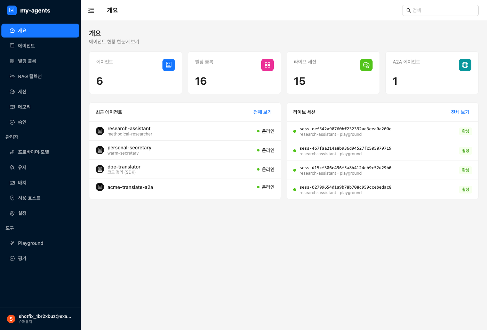
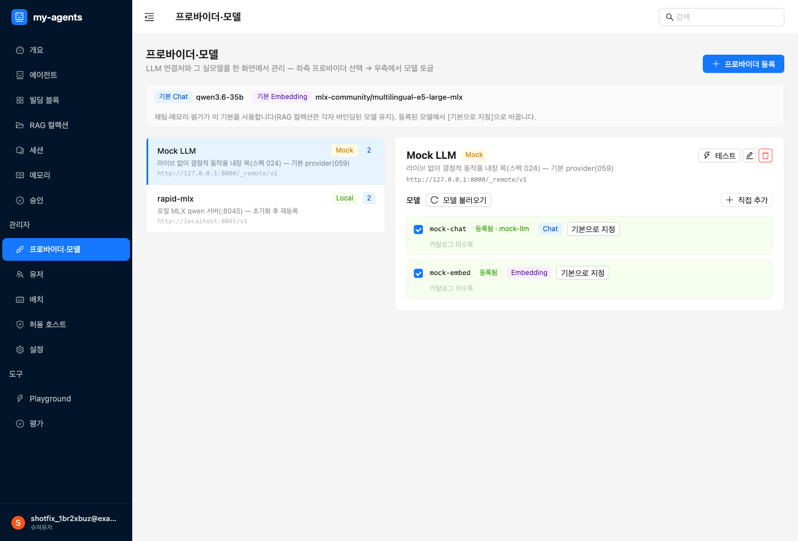
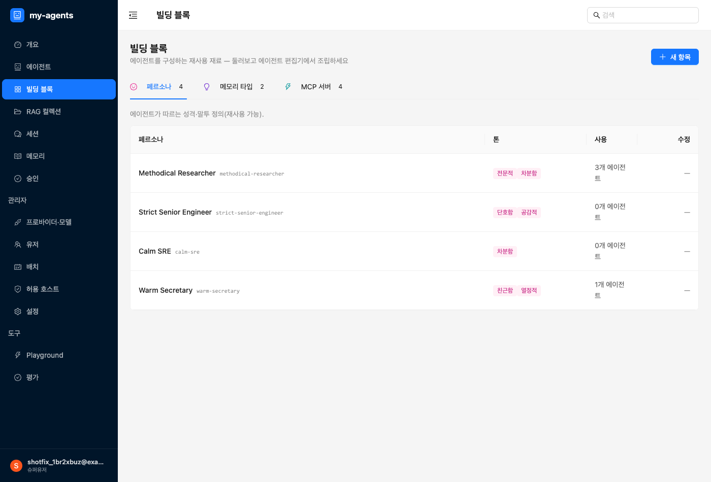
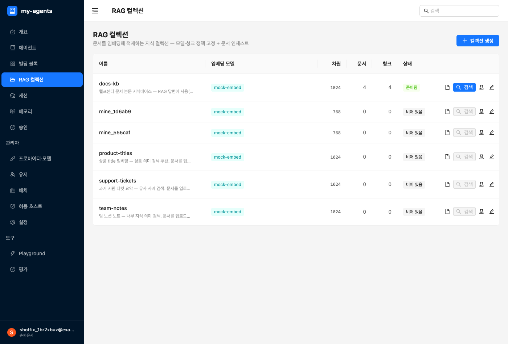
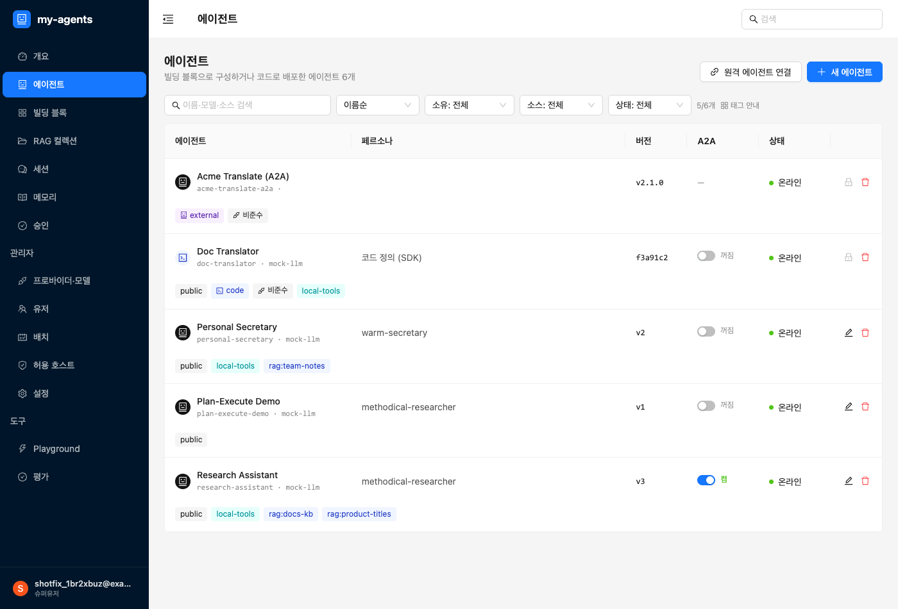
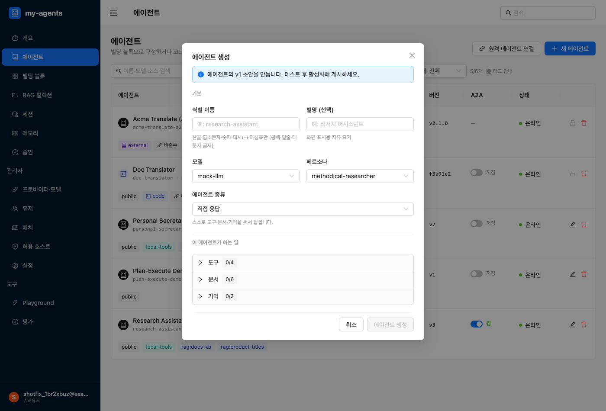
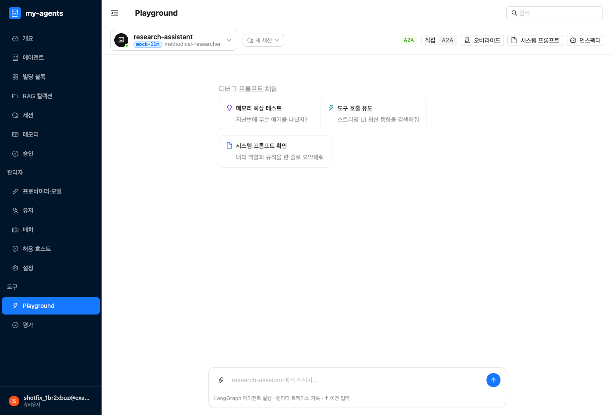
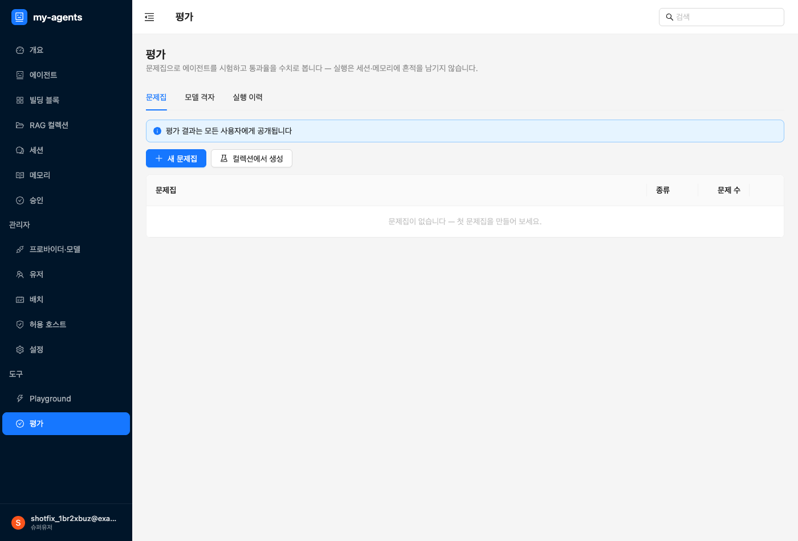
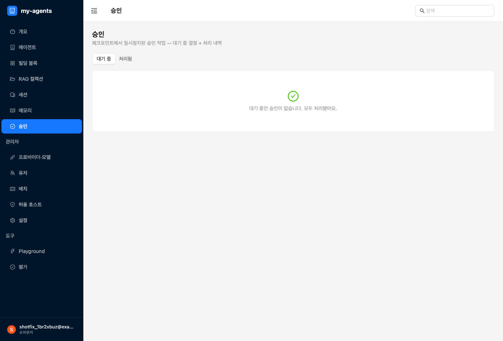

# 노코드 에이전트 만들기 가이드

> 코드를 몰라도 됩니다. 이 문서는 **어드민 화면에서 클릭만으로** AI 에이전트를 만들고, 도구·문서·기억을
> 붙이고, 테스트하고, 품질과 안전을 관리하는 법을 처음 보는 분 눈높이로 설명합니다.

## 이 서비스가 하는 일

한 줄로: **나만의 AI 에이전트(챗봇·업무 도우미)를 코드 없이 만들고 관리하는 곳**입니다.

에이전트 하나는 이런 것들의 조합입니다:
- **역할**(페르소나) — "무엇을 하는 누구"인지 (예: 친절한 CS 상담원)
- **두뇌**(모델) — 실제로 말을 만들어내는 AI 모델
- **도구·문서·기억** — 필요하면 붙이는 능력 (외부 도구 호출, 참고 문서 검색, 대화 기억)

이 모든 걸 왼쪽 메뉴에서 만듭니다.

## 왼쪽 메뉴 한눈에 보기

| 메뉴 | 무엇을 하는 곳 |
|---|---|
| **개요** | 전체 현황을 한눈에 보는 대시보드 |
| **에이전트** | 에이전트를 만들고 관리 (여기가 중심) |
| **빌딩 블록** | 에이전트에 붙일 **재료**를 등록 — 역할(페르소나)·메모리 타입·**도구(MCP)** |
| **RAG 컬렉션** | 에이전트가 검색해 참고할 **문서 묶음**을 만들고 채움 |
| **세션** | 지난 대화 기록 보기 |
| **메모리** | 에이전트가 사용자에 대해 기억한 것 보기·관리 |
| **승인** | 위험한 작업을 실행 전에 **사람이 승인/거절** |
| 관리자 › **프로바이더·모델** | 에이전트가 쓸 AI 모델을 등록 |
| 관리자 › **유저** | 이 서비스를 쓰는 사람과 **권한** 관리 |
| 관리자 › **배치** | 정기적으로 도는 작업 |
| 관리자 › **허용 호스트** | 외부와 연결할 때 허용할 주소 목록 |
| 관리자 › **설정** | 서비스 전체 설정 |
| 도구 › **Playground** | 만든 에이전트와 **직접 대화하며 테스트** |
| 도구 › **평가** | 에이전트 답의 **품질을 채점** |

> 순서가 헷갈리면 이것만 기억하세요: **모델 등록 → (필요하면) 재료 등록 → 에이전트 만들기 → Playground에서 테스트.**

## 1단계 — 처음 한 번: 준비물 갖추기

### ① 모델 등록 (필수) — `프로바이더·모델`
에이전트가 돌아가려면 **AI 모델**이 최소 하나 있어야 합니다. `관리자 › 프로바이더·모델`에서
모델 제공처(프로바이더)와 모델을 등록합니다. 이게 없으면 에이전트를 만들 때 "등록된 채팅 모델이
없습니다"가 뜹니다 — 여기부터 하세요.

### ② 도구 등록 (선택) — `빌딩 블록`
에이전트가 외부 기능(예: 계산, 검색, 사내 API)을 쓰게 하려면 **MCP 도구**를 등록합니다.

`빌딩 블록`에서 두 가지 방식:
- **새 로컬 MCP 서버** — 직접 운영하는 서버를 등록합니다(나중에 외부에 공개도 가능).
- **외부 MCP 등록** — 다른 곳에서 이미 공개한 MCP 서버에 연결해 그 도구를 가져와 씁니다.

지금 필요 없으면 건너뛰어도 됩니다 — 에이전트는 도구 없이도 대화합니다.

### ③ 참고 문서 만들기 (선택) — `RAG 컬렉션`
에이전트가 우리 문서를 찾아보고 답하게 하려면 **RAG 컬렉션**(문서 묶음)을 만듭니다.
`RAG 컬렉션`에서 이름과 **임베딩 모델**을 정하고(임베딩 모델도 `프로바이더·모델`에서 먼저 등록),
행을 업로드합니다. 스키마를 등록하면 업로드 행을 검증해줍니다.

> "RAG"는 어려운 말 같지만 뜻은 간단합니다: **에이전트가 답하기 전에 등록한 문서에서 관련 내용을
> 찾아보게 하는 것**. 사내 규정·제품 설명 같은 걸 정확히 답하게 할 때 씁니다.

## 2단계 — 에이전트 만들기 (`에이전트` 메뉴)

`에이전트` 목록의 **새 에이전트** 버튼을 누르면 생성 폼이 열립니다.

순서대로 채웁니다. 아래쪽 "이 에이전트가 하는 일"이 곧 권한 설정입니다.

### 기본 정보 (필수)
- **식별 이름** / **별명** — 이 에이전트를 부를 이름
- **모델** — 1단계에서 등록한 모델 중 선택
- **페르소나** — 역할·말투·해야 할 일 (빌딩 블록에서 고르거나 직접 입력)
- **종류** — 둘 중 하나:
  - **직접 응답** — 스스로 도구·문서·기억을 써서 답합니다 (대부분 이것)
  - **조율형** — 일을 다른 에이전트·도구에 넘겨 처리합니다

### "하는 일" 붙이기 = 권한 설정
직접 응답 에이전트라면 아래를 **체크로 붙입니다**. **여기서 체크한 것만 그 에이전트가 쓸 수 있습니다**
— 즉 이게 곧 **권한 설정**입니다(안 붙이면 못 씁니다, 기본 차단).
- **도구** — 빌딩 블록에 등록한 MCP 중 이 에이전트에게 허용할 것
- **문서(RAG)** — 검색을 허용할 컬렉션
- **기억** — 대화 기억, 그리고 *사용자 기억 읽기 / 저장*
  - "**사용자 기억에 저장 · 승인 필요**"처럼 일부 능력은 **실행 전 승인**을 받도록 표시됩니다(아래 5단계).

저장하면 에이전트가 생깁니다. (권한이 실제로 어떻게 걸리는지는 바로 아래에서 자세히 설명합니다.)

## 권한 이해하기 — 세 층으로 걸립니다

권한은 한 곳이 아니라 **세 층**에서 걸립니다. "누가(사람) → 무엇을(에이전트) → 얼마나 조심해서(승인)"
순서로 기억하면 쉽습니다.

### 층 1 — 사람의 권한 (`관리자 › 유저`)

이 서비스를 쓰는 **사람**에게 역할을 부여합니다:

| 역할 | 할 수 있는 것 |
|---|---|
| **admin** | 전부 — 모든 메뉴·자원·승인 처리 |
| **member** | 기본 사용자 — 에이전트를 만들고 쓰되, 민감한 작업(예: 데이터 삭제 승인)은 못 함. 단, **자기 기억에 쓰는 건 본인이 승인** 가능 |
| **슈퍼유저** (계정 옵션) | 권한 검사를 아예 우회 — 신중히 부여 |

`관리자 › 유저`에서 계정을 만들고, 역할을 부여/회수하고, 계정을 켜고 끕니다. (공개 가입은 없습니다 —
계정은 관리자가 만듭니다.)

### 층 2 — 에이전트의 권한 (에이전트 폼의 "하는 일")

에이전트는 **체크로 붙인 도구·문서·기억만** 쓸 수 있습니다. 기본은 전부 차단이고, 붙인 것만 열립니다.

여기에 중요한 규칙이 하나 더 있습니다 — **내 에이전트에 붙일 수 있는 자원의 범위**:

- **내가 만든** 도구·컬렉션 → 붙일 수 있음
- **다른 사람이 만들었지만 "공개"한** 것 → 붙일 수 있음
- **다른 사람의 비공개** 자원 → 붙일 수 없음 (관리자는 예외 — 전부 가능)

그래서 팀에서 도구를 나눠 쓰려면, 만든 사람이 빌딩 블록에서 그 MCP를 **공개**로 켜면 됩니다.
공개 전까지는 만든 본인(과 관리자)만 씁니다.

> 왜 이렇게 하냐면: 남의 비공개 자원 이름을 슬쩍 적어 넣어 그 사람 권한으로 실행시키는 걸 막기
> 위해서입니다. 에이전트는 **만든 사람이 쓸 수 있는 자원까지만** 쓸 수 있습니다.

### 층 3 — 도구별 승인 정책 (기본값 + 에이전트별 오버라이드)

도구 중엔 위험한 것(삭제·쓰기·돈이 드는 것)이 있습니다. 그런 도구는 **호출 직전에 사람 승인**을
받게 할 수 있고, 두 단계로 정합니다:

1. **기본값** — `빌딩 블록`에서 MCP의 도구별로 "**승인 필요**" 체크. 여기서 켜면 그 도구를 쓰는
   **모든 에이전트**에 적용되는 기본 정책이 됩니다. (도구 권한의 출발점은 관리자가 여기서 세웁니다.)
2. **에이전트별 오버라이드** — 에이전트 폼의 "**도구 승인 오버라이드**"에서 이 에이전트에 한해
   덮어씁니다. 선택지는 셋:
   - **관리자 승인** — 관리자가 승인해야 실행
   - **본인 승인** — 요청한 사용자 본인이 승인하면 실행
   - **끔** — 승인 없이 바로 실행

> **조이는 건 누구나, 푸는 건 관리자만.** 승인을 *추가*하는 오버라이드(끔→관리자 승인 등)는 아무나
> 저장할 수 있지만, 승인을 *끄거나 약하게*(관리자 승인→본인 승인/끔) 하는 오버라이드는 **관리자만
> 저장할 수 있습니다**. 일반 사용자가 안전장치를 몰래 해제하는 걸 막기 위해서입니다.

### 정리 — 도구 하나가 실행되기까지

에이전트가 도구를 부르는 순간, 이 순서로 확인됩니다:

1. 이 에이전트에 그 도구가 **붙어 있나?** (층 2 — 없으면 그냥 못 씀)
2. 에이전트를 만든 사람이 그 도구를 **쓸 수 있는 사람인가?** (층 1·2 — 소유/공개/역할)
3. 이 도구는 **승인이 필요한가?** (층 3 — 필요하면 멈추고 `승인` 메뉴로, 아래 5단계)

셋 다 통과해야 실행됩니다. 하나라도 막히면 실행되지 않는 게 기본값입니다(안전 우선).

## 3단계 — 테스트하기 (`Playground`)

`도구 › Playground`에서 방금 만든 에이전트를 골라 **직접 대화**해봅니다.

- 실제로 어떻게 답하는지 바로 확인
- 도구·문서가 **언제 불렸는지**, 무엇을 검색했는지 화면에 보입니다 (기대대로 도구를 쓰는지 점검)
- 페르소나·설정을 바꿔가며 비교해볼 수 있습니다

> Playground는 "정밀 테스트 통로"입니다 — 배포 전에 여기서 충분히 굴려보세요.

## 4단계 — 품질 관리 (`평가`)

`도구 › 평가`에서 에이전트 답의 **품질을 채점**합니다.

- **문제집**을 만듭니다: 안에 문제(에이전트에게 보낼 **질문** + 기대하는 **채점 기준**)를 담습니다
- 기준에는 "답에 이 내용이 있어야" 같은 것뿐 아니라 **"이 도구/문서가 꼭 불려야 한다"**도 넣을 수 있습니다
  - 예: RAG를 꼭 써야 하는 질문인데 안 쓰고도 그럴듯하게 답하면 **통과시키면 안 되므로**, '필수 도구/노드'
    기준을 넣습니다.
- 에이전트나 RAG 컬렉션을 골라 시험을 돌리고, 점수 추이를 봅니다.

> 평가는 "바꿨더니 더 나아졌나/나빠졌나"를 숫자로 확인하는 안전망입니다.

## 5단계 — 안전장치 (`승인`)

위험하거나 되돌리기 어려운 작업(예: 데이터 삭제, 사용자 기억에 쓰기)은 에이전트가 **바로 실행하지 않고
멈춰서 사람의 승인을 기다리게** 할 수 있습니다.
- 2단계에서 "**· 승인 필요**"로 표시된 능력이 그것입니다.
- 그런 작업이 걸리면 대화가 "⏸ 승인 대기"로 멈추고, `승인` 메뉴(또는 상단 배지)에 항목이 뜹니다.
- 담당자가 **승인**하면 그때 실행되고, **거절**하면 실행되지 않습니다(안전 기본값 = 실행 안 함).

## 운영 메뉴 (필요할 때)

- **세션** — 지난 대화들을 찾아보고 검토
- **메모리** — 에이전트가 사용자에 대해 기억한 내용을 보고 정리
- **배치** — 정기 작업(예: 오래된 데이터 정리) 관리
- **허용 호스트** — 외부 MCP·에이전트와 연결할 때 허용 주소 관리

## 자주 막히는 곳

- **"등록된 채팅 모델이 없습니다"** → `프로바이더·모델`에서 모델을 먼저 등록하세요(1단계 ①).
- **RAG 컬렉션에서 임베딩 모델을 못 고름** → 임베딩 모델을 `프로바이더·모델`에 먼저 등록하세요.
- **에이전트가 도구를 안 씀** → 2단계에서 그 도구를 **체크해 붙였는지**, Playground에서 실제로 불리는지
  확인하세요.
- **외부 MCP 연결이 안 됨** → `허용 호스트`에 주소가 있는지 확인하세요.

---

> **참고 — 산출물형(결과물 수집) 에이전트:** "대화로 정보를 모아 정해진 결과물(JSON)을 만들어 외부로
> 보내는" 특수한 에이전트는 지금은 **코드로** 만듭니다([개발자 가이드](./artifact-agent-developer.md)).
> 이것의 **노코드 버전**(화면에서 항목·후보·보낼 곳만 정하면 되는)은 준비 중입니다.
