# my-agents 유저 가이드

에이전트를 만들고, 실행하고, 운영하는 플랫폼의 사용 안내서다. 화면 순서대로 위에서 아래로 읽으면
전체 기능을 한 바퀴 돌게 된다. 개발(SDK) 관점은 [개발 가이드](dev-guide.md), 구조는
[시스템 아키텍처](architecture.md)를 참고한다.

## 1. 플랫폼 개요

my-agents는 LLM 에이전트를 **웹 화면에서 조립**하거나 **코드(SDK)로 배포**해 운영하는 플랫폼이다.
핵심 개념은 다섯 가지다.

| 개념 | 설명 |
|---|---|
| 에이전트 | 실행 단위. 프롬프트·모델·도구·기억을 묶은 구성이며, 버전으로 관리된다 |
| 빌딩 블록 | 에이전트를 구성하는 재사용 재료 — 프롬프트, 메모리 타입, MCP 서버(MCP — 도구 제공 표준 프로토콜) |
| RAG 컬렉션 | 에이전트가 검색해 근거로 쓰는 문서 저장소(RAG — 문서 검색으로 답변 근거를 보강하는 기법) |
| 세션 | 사용자와 에이전트가 나눈 대화 기록 |
| 승인 | 위험 작업(삭제·전송 등) 실행 전 사람이 허가하는 관문(HIL — Human-in-the-Loop) |

에이전트는 세 가지 방식으로 만든다.

- **내부 (UI)**: 화면에서 조립. 코드가 필요 없다.
- **내부 (Code)**: SDK로 작성해 배포. 원격 엔드포인트로 연결된다.
- **외부**: 다른 시스템의 A2A(Agent-to-Agent — 에이전트 간 표준 프로토콜) 에이전트를 연결해 쓴다.

로그인하면 왼쪽 사이드바에 메뉴가 보인다. 위쪽은 일상 작업(개요~승인), 가운데 **관리자** 그룹은
운영 설정, 아래 **도구** 그룹은 실행·검증 도구다. 이 가이드는 그 순서를 따른다.

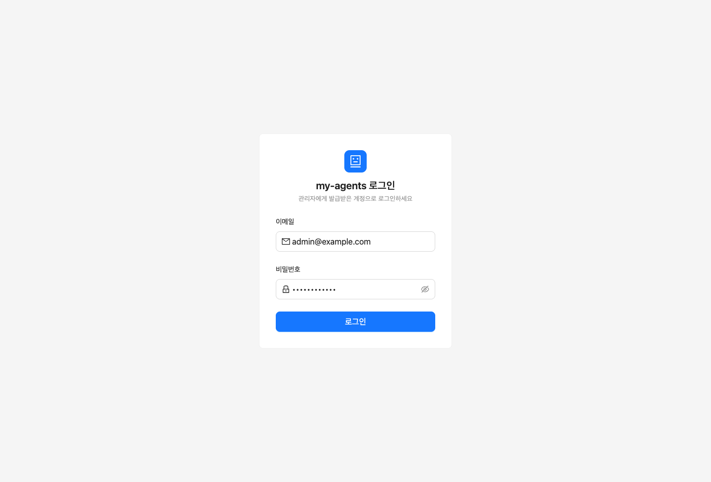

## 2. 개요

접속 후 첫 화면. 플랫폼 현황을 한눈에 보여준다.

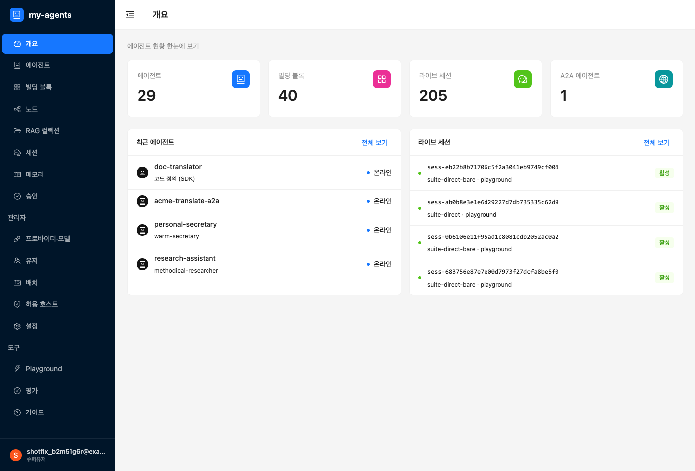

- 상단 카드 4개: 에이전트 수 · 빌딩 블록 수 · 라이브 세션 수 · 연결된 A2A 에이전트 수.
- **최근 에이전트**: 최근 만들었거나 수정한 에이전트와 온라인 상태. 이름을 누르면 상세로 이동한다.
- **라이브 세션**: 지금 활성인 대화. `전체 보기`로 세션 메뉴로 이동한다.

## 3. 에이전트

에이전트의 목록·생성·수정·배포를 담당하는 중심 메뉴다.

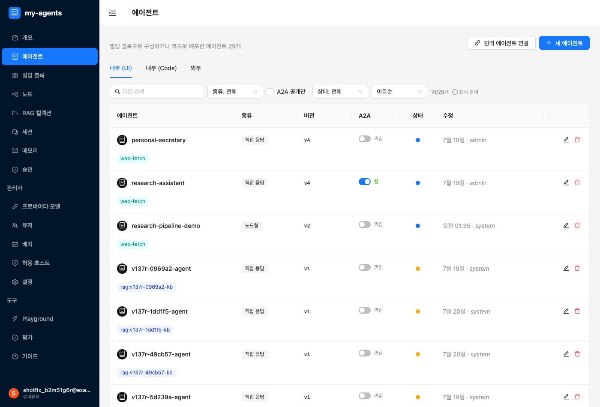

- 탭 세 개가 만드는 방식과 대응한다: **내부 (UI)** / **내부 (Code)** / **외부**.
- 목록 컬럼: 종류(직접 응답·노드형 등) · 활성 버전 · A2A 공개 토글 · 상태 · 수정 일시.
  이름 아래 태그는 연결된 자원(MCP 도구, `rag:` 컬렉션)이다.
- 오른쪽 위 `새 에이전트`로 생성, `원격 에이전트 연결`로 외부 A2A 에이전트를 등록한다.

### 3.1 에이전트 만들기

`새 에이전트`를 누르면 4단계 마법사가 열린다.

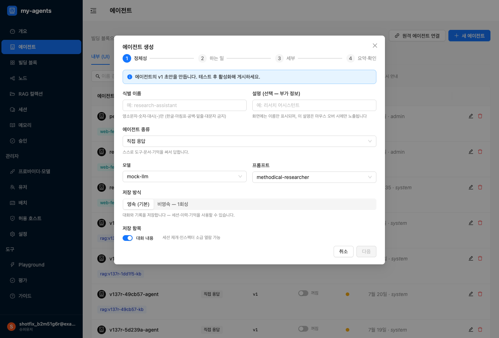

1. **정체성** — 식별 이름(영소문자·숫자·대시), 에이전트 종류, 모델, 프롬프트, 저장 방식(영속/비영속).
2. **하는 일** — 종류별 구성. 직접 응답이면 도구·문서·기억 연결, 노드형이면 노드 파이프라인 편집.
3. **세부** — 대화 이력 깊이, 도구 승인 정책 등 세부 조정.
4. **요약·확인** — 구성을 확인하고 v1 초안을 만든다.

에이전트 종류는 실행 방식을 정한다.

| 종류 | 동작 |
|---|---|
| 직접 응답 | 하나의 에이전트가 도구·문서·기억을 스스로 써서 답한다(기본) |
| 노드형 | 여러 노드를 순서대로 실행하는 파이프라인. 노드마다 모델·프롬프트·도구를 따로 정한다 |
| 조율형 | 질문을 분석해 등록된 능력(다른 에이전트·도구)에 위임하고 결과를 종합한다 |
| 산출물형 | 정해진 형식의 산출물을 질문·폼으로 채워 완성한다 |

### 3.2 버전과 배포

생성 직후는 **v1 초안**이다. Playground에서 시험한 뒤 **활성화**하면 그 버전이 게시되고, 이후
수정은 새 버전 초안으로 쌓인다. 활성 버전은 변경되지 않으므로 운영 중인 대화가 흔들리지 않는다.

### 3.3 A2A 공개

목록의 A2A 토글을 켜면 이 에이전트가 A2A 프로토콜로 외부에 노출된다. 외부 시스템은 에이전트
카드를 조회하고 대화를 보낼 수 있다.

## 4. 빌딩 블록

에이전트를 구성하는 재사용 재료의 카탈로그다. 탭 세 개로 나뉜다.

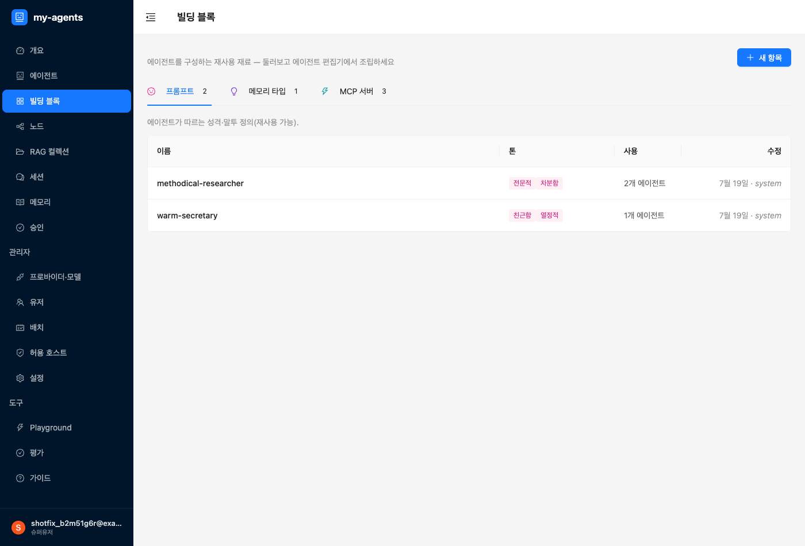

- **프롬프트**: 에이전트가 따르는 성격·말투 정의. 어떤 에이전트가 몇 개나 쓰는지(`사용` 컬럼) 보인다.
- **메모리 타입**: 기억의 분류 체계(예: 업무 기억).
- **MCP 서버**: 에이전트에 도구를 공급하는 서버. 서버를 등록하면
  그 도구들이 에이전트 편집기에서 연결 가능해진다.

블록은 **버전**으로 관리된다. 블록을 수정해도 이미 게시된 에이전트 버전은 기존 블록 버전을
계속 쓰고, 에이전트를 새로 활성화할 때 최신 블록이 반영된다.

## 5. 노드

노드형 에이전트에서 재사용하는 노드 카탈로그다. 자주 쓰는 노드 구성(모델·프롬프트·도구 묶음)을
등록해 두면 파이프라인 편집기에서 꺼내 쓸 수 있다.

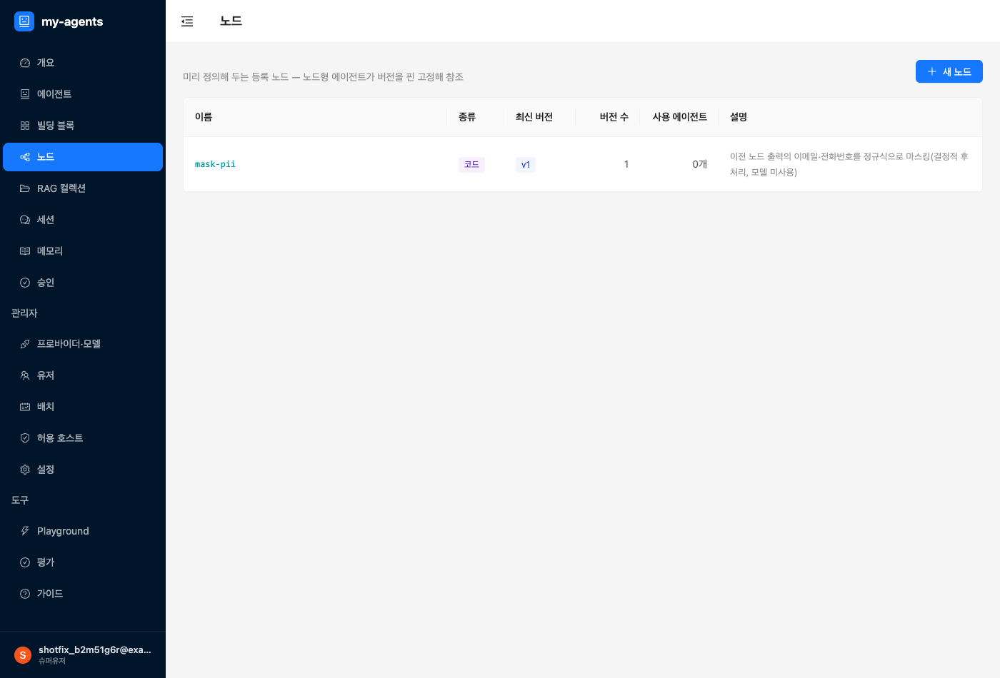

## 6. RAG 컬렉션

에이전트가 검색해 근거로 쓰는 문서 저장소다.

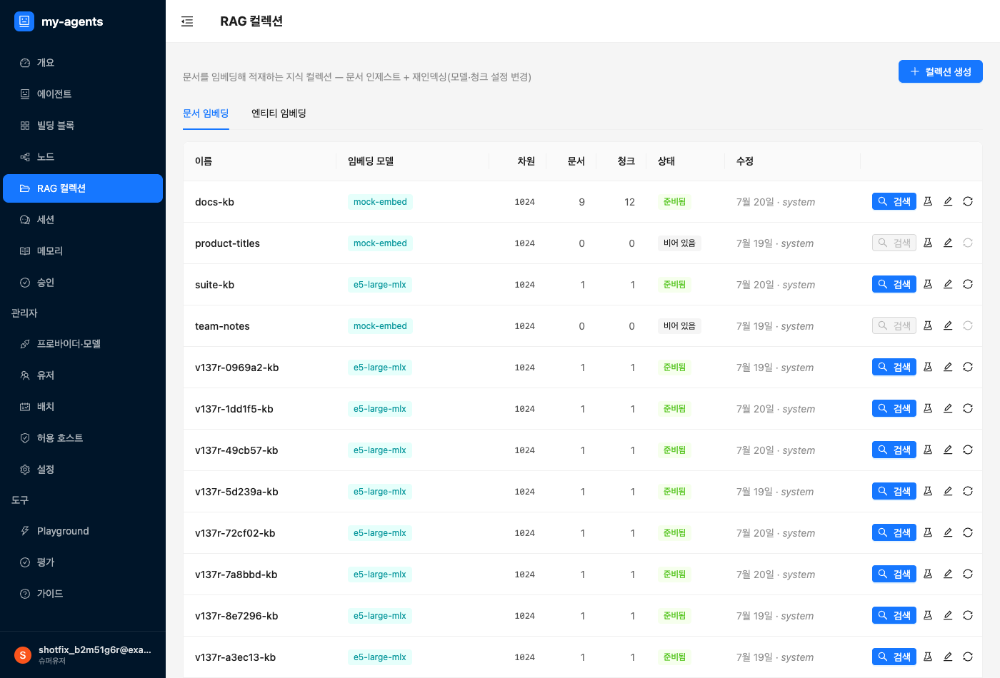

- 탭 두 개: **문서 임베딩**(일반 문서 검색)과 **엔티티 임베딩**(정형 항목 검색).
- 컬렉션을 만들고 문서를 올리면 자동으로 분할·색인된다(임베딩 — 문장을 검색 가능한 숫자 벡터로
  변환하는 과정). 목록에서 컬렉션별 임베딩 모델·차원·문서/청크(검색 단위로 자른 문서 조각) 수·
  상태를 확인한다.
- `검색` 버튼으로 실제 질의를 넣어 어떤 문단이 회수되는지 시험한다.
- 문서를 수정하면 전체 재인덱싱으로 반영되고, 임베딩 모델·청크 설정을 바꿔도 재인덱싱한다.
  에이전트 편집기에서 컬렉션을 연결하면 그 에이전트가 답변 전에 검색해 근거로 쓴다.

## 7. 세션

모든 채널에서 에이전트와 진행 중인 대화의 기록이다.

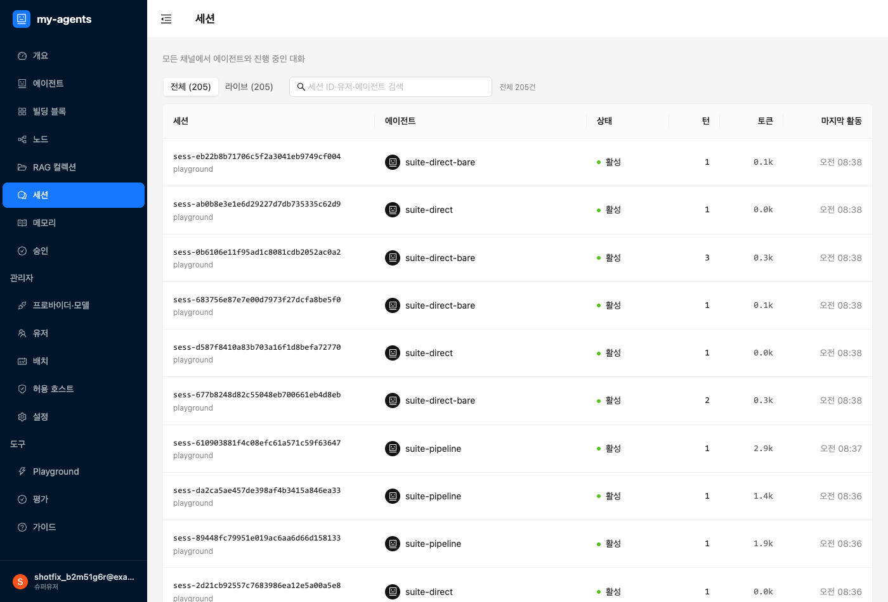

- **전체/라이브** 탭과 검색(세션 ID·유저·에이전트)으로 찾는다. 목록 컬럼: 세션 ID와 채널
  (playground, a2a 등) · 에이전트 · 상태 · 턴 수 · 토큰 사용량 · 마지막 활동.
- 세션을 열면 대화 전체와 턴별 실행 기록(어떤 노드가 돌고 어떤 도구를 불렀는지)을 볼 수 있다.
- 영속으로 만든 에이전트의 대화만 저장돼 여기 나타난다(비영속 에이전트의 대화는 저장하지 않는다).

## 8. 메모리

에이전트 전용 기억과 유저 기억(mem0 기반 장기 기억)을 조회·교정한다.

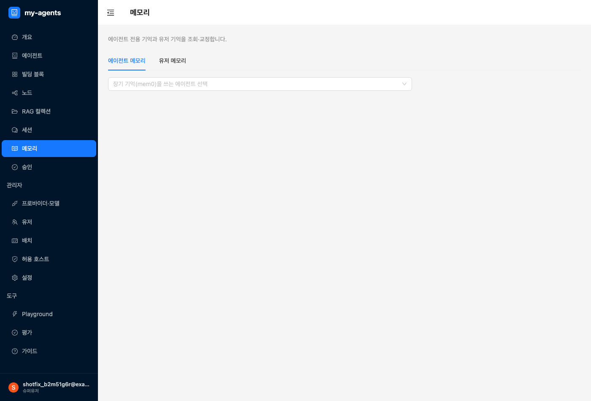

- **에이전트 메모리** 탭: 장기 기억을 쓰는 에이전트를 선택해 그 에이전트에 쌓인 기억을 보고
  고친다. 관리자가 지식을 직접 넣는 통로이기도 하다.
- **유저 메모리** 탭: 사용자별로 자동 추출된 사실(세션을 가로질러 회상됨)을 검색·수정·삭제한다.
- 회상이 이상할 때 "무엇이 기억돼 있나"를 여기서 확인하는 것이 진단의 첫 단계다.

## 9. 승인

위험 작업의 허가 대기함이다. 에이전트가 삭제·전송처럼 되돌리기 어려운 도구를 부르면 실행 직전에
멈추고 여기 승인 요청이 생긴다.

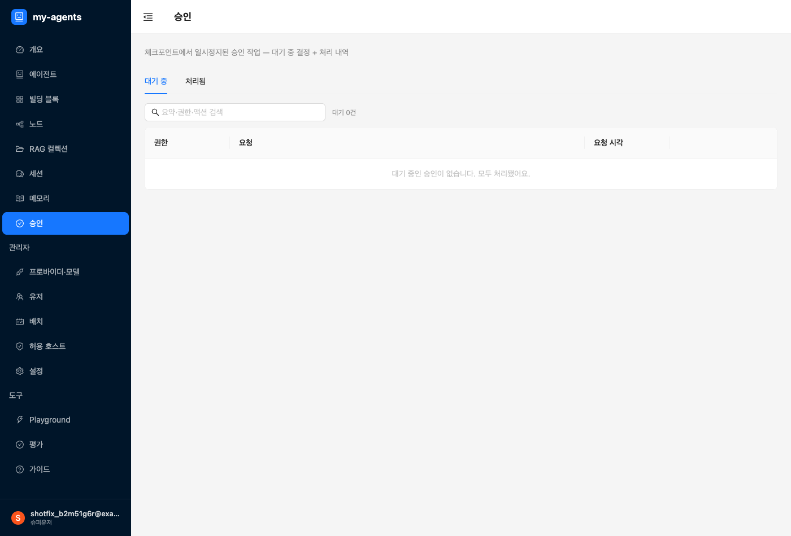

- 요청 카드에는 어떤 에이전트가 어떤 도구를 어떤 인자로 부르려는지 표시된다.
- **승인**하면 멈춘 지점부터 실행이 이어지고, **거절**하면 도구는 실행되지 않은 채 대화가 마무리된다.
- 첨부 문서가 있는 대화는 문서 속 지시가 도구를 부추길 수 있어 승인 요구가 더 넓게 걸린다.

## 10. 관리자

운영 설정 그룹이다. 관리자 권한이 필요하다.

### 10.1 프로바이더·모델

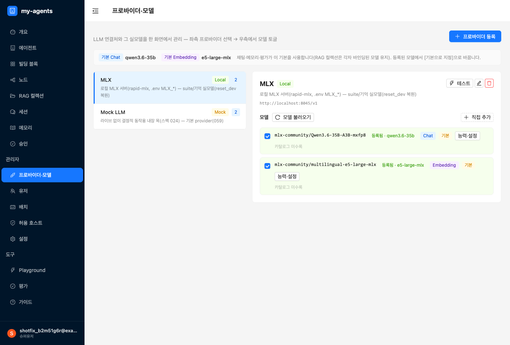

LLM 연결처와 실모델을 한 화면에서 관리한다 — 왼쪽에서 프로바이더(OpenAI 호환 엔드포인트)를
고르고, 오른쪽에서 그 서버의 모델을 불러와 체크로 등록한다.

- 상단에 **기본 Chat / 기본 Embedding** 모델이 표시된다. 채팅·메모리·평가가 이 기본을 쓴다.
- 모델별 `능력·설정`에서 스트리밍 등 동작 방식을 조정하고, `테스트`로 연결을 확인한다.
- 여기 등록된 모델만 에이전트에서 선택할 수 있다.

### 10.2 유저

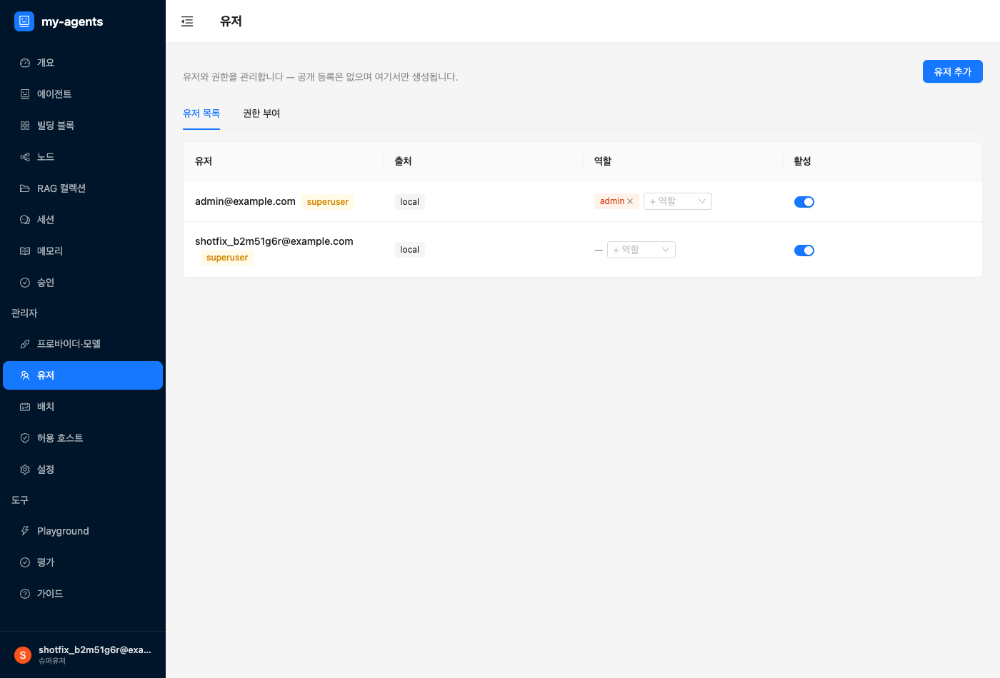

계정과 역할(RBAC — 역할 기반 접근 제어)을 관리한다. 역할이 에이전트 실행·관리 범위를 정한다.

### 10.3 배치

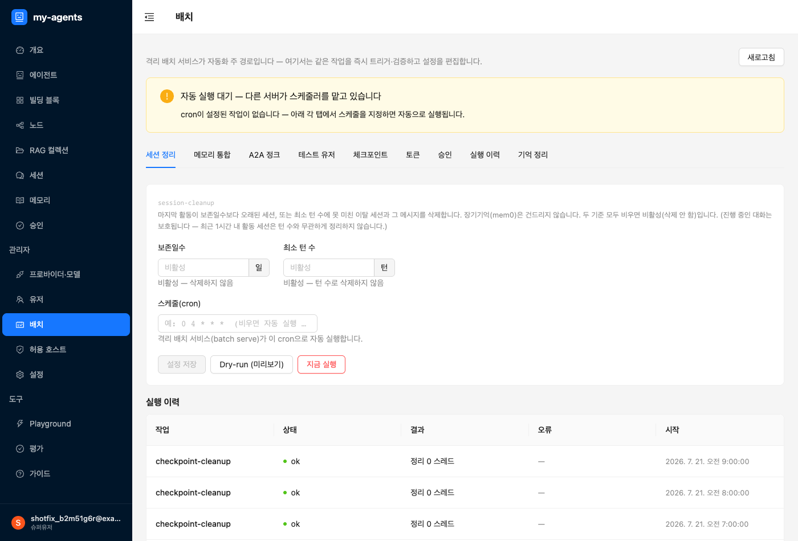

주기 작업(오래된 기록 정리, 보존 정책 등)의 실행 이력과 설정이다.

### 10.4 허용 호스트

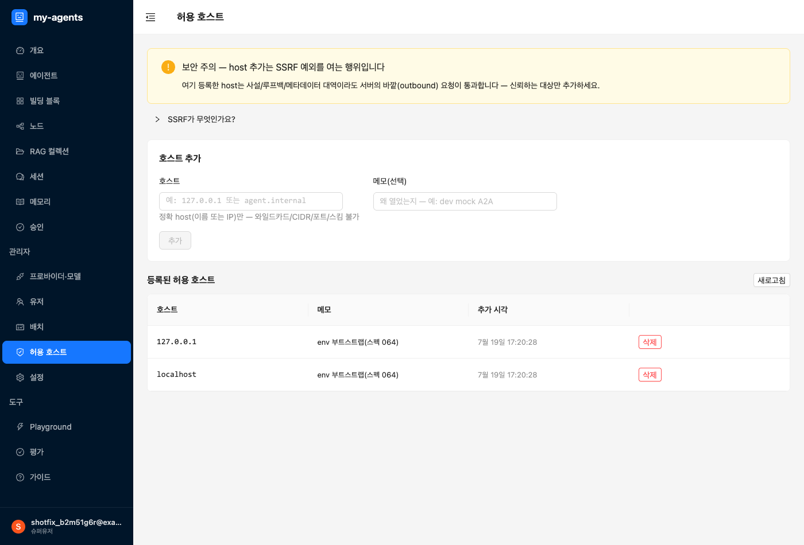

에이전트가 외부로 요청할 수 있는 호스트 허용 목록이다. 목록에 올린 주소로만 요청이 나간다
(SSRF — 내부망 침투 요청 — 차단).

### 10.5 설정

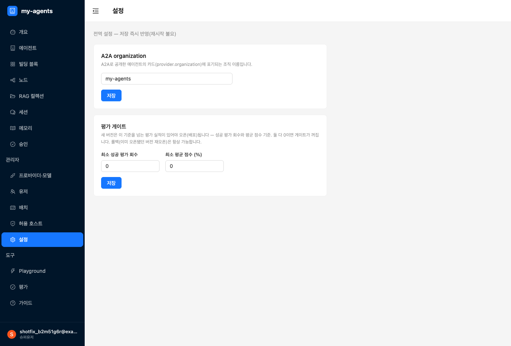

플랫폼 전역 설정이다.

## 11. 도구

### 11.1 Playground

에이전트를 실제로 실행해 보는 대화 화면이자 정밀 디버깅 도구다.

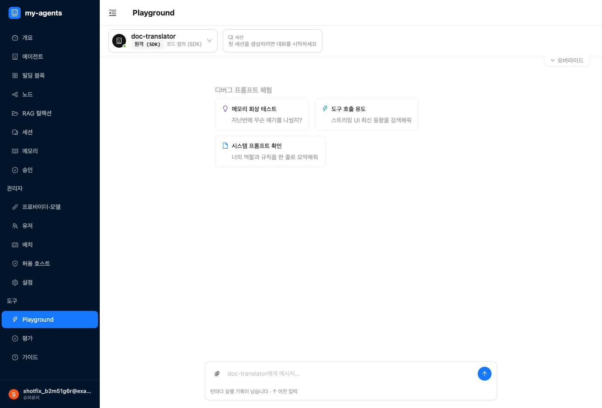

- 상단에서 에이전트와 세션을 고른다. 첫 입력과 함께 세션이 만들어진다.
- **디버그 프롬프트 체험**: 메모리 회상·도구 호출·시스템 프롬프트를 바로 시험하는 지름길.
- **오버라이드**: 게시된 구성을 바꾸지 않고 이번 대화에만 모델·프롬프트·도구 구성을 덮어써
  시험한다. 초안 검증에 쓴다.
- 응답 아래 **인스펙터**에서 턴의 실행 기록을 본다 — 실행된 노드 순서, 도구 호출과 인자·결과,
  회상된 기억, 소요 시간. 문제를 재현하고 원인을 좁히는 기본 통로다.
- 입력창은 첨부(문서를 이번 대화의 근거로)와 입력 히스토리(↑ 키)를 지원한다.

### 11.2 평가

문제집으로 에이전트를 시험하고 통과율을 수치로 보는 도구다. 평가 실행은 세션·메모리에 흔적을
남기지 않는다.

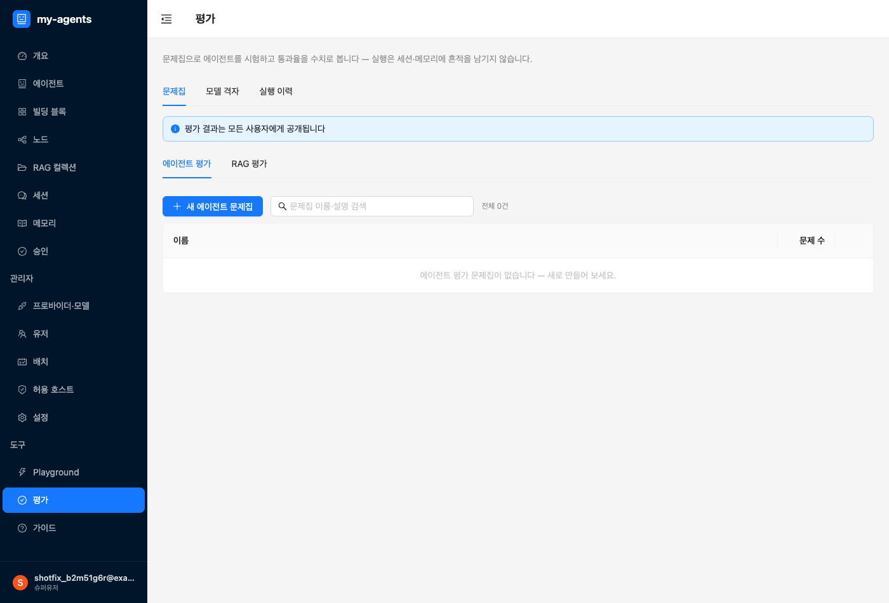

- **문제집** 탭: 에이전트 평가와 RAG 평가로 나뉜다. 문제(질문과 기대 기준)를 만들고 실행하면
  심판 모델이 응답을 채점한다. 문제 자동 제안 기능이 초기 작성을 돕는다.
- **모델 격자** 탭: 같은 문제집을 여러 모델에 돌려 격자로 비교한다.
- **실행 이력** 탭: 버전 간 품질 추이를 본다. 평가 결과는 모든 사용자에게 공개된다.

### 11.3 가이드

인앱 도움말이다. 새 탭으로 열린다.

---

부록 — 자주 하는 작업 빠른 경로

| 하고 싶은 일 | 경로 |
|---|---|
| 에이전트 새로 만들기 | 에이전트 → 새 에이전트 → 4단계 마법사 |
| 만든 에이전트 시험하기 | Playground → 에이전트 선택 → 대화 |
| 구성 바꿔 실험(게시 영향 없이) | Playground → 오버라이드 |
| 문서를 검색 근거로 연결 | RAG 컬렉션 → 컬렉션 생성·문서 업로드 → 에이전트 편집기에서 연결 |
| 위험 도구 실행 허가 | 승인 → 요청 확인 → 승인/거절 |
| 모델 추가 | 관리자 → 프로바이더·모델 |
| 외부에 에이전트 공개 | 에이전트 목록 → A2A 토글 |
